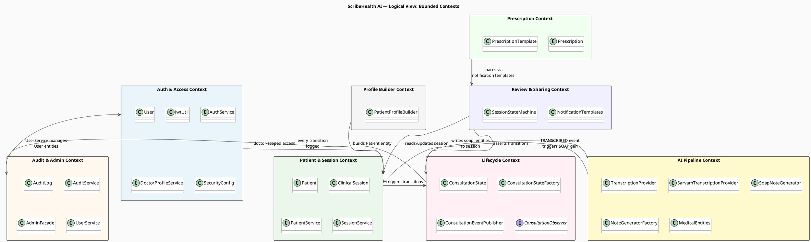
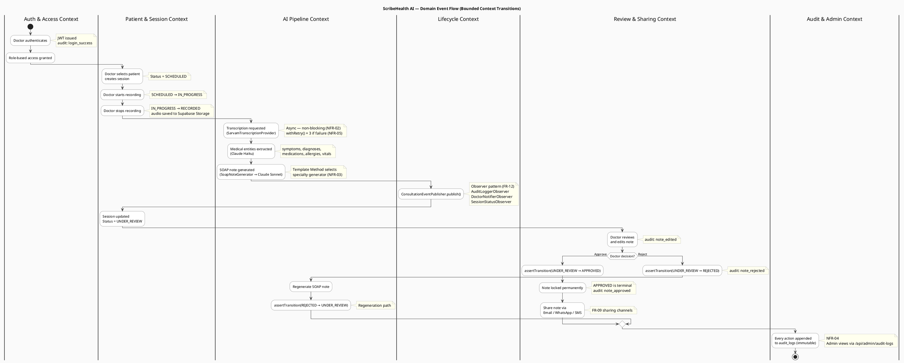

# Logical View — Bounded Contexts & Event Flows

> **4+1 View: Logical** — Shows how the system is decomposed into bounded contexts (packages) and how domain events flow between them.

---

## Package Diagram — Bounded Contexts

**What this shows:** The system is divided into 8 bounded contexts, each with a clear, non-overlapping responsibility. These are not arbitrary groupings — they map directly to Java packages on the backend (`com.scribehealth.lifecycle`, `com.scribehealth.facade`, etc.) and TypeScript modules on the frontend (`lib/session-state-machine.ts`, `lib/soap-note-generator.ts`).

**Key design decisions visible here:**
- The **Lifecycle Context** is the hub of the event-driven architecture. It sits between the Patient & Session Context (which produces state changes) and both the AI Pipeline and Audit contexts (which consume those state changes). This decouples the pipeline stages from each other.
- The **Auth & Access Context** feeds the Patient & Session Context with a `doctor_email`-scoped access model — no patient or session query runs without this constraint, enforcing FR-01 data isolation.
- The **Profile Builder Context** is isolated because `PatientProfileBuilder` runs complex validation (ICD code format, email regex, phone digit count) that has no dependency on persistence — it is pure construction logic.
- The **Prescription Context** depends only on the Review & Sharing Context (for notification templates), keeping it completely decoupled from the AI Pipeline and Session state machine.

---

## Activity Diagram — Domain Event Flow Across Contexts

**What this shows:** The same 8 bounded contexts as a swim-lane activity diagram, with each swim lane representing one context. This makes the handoff points between contexts explicit — every transition across a lane boundary is an architectural integration point.

**Key flows to note:**
- After the AI Pipeline Context finishes SOAP generation, control passes to the **Lifecycle Context** (`ConsultationEventPublisher.publish()`), not directly back to the session. This is the Observer pattern in action — the pipeline does not know who listens, ensuring decoupling.
- The **Review & Sharing Context** hosts the only human decision point in the system (Approve / Reject). This is the human-in-the-loop gate required by NFR-01: no AI output enters permanent storage without a doctor action.
- The **Reject** branch loops back into the AI Pipeline Context for regeneration, then re-enters UNDER_REVIEW. This is the only valid escape from the REJECTED state.
- The **Audit & Admin Context** lane is shown as a parallel terminal: every action in every other lane produces an append to `audit_logs`. It is passive — it never drives the flow, only records it.

