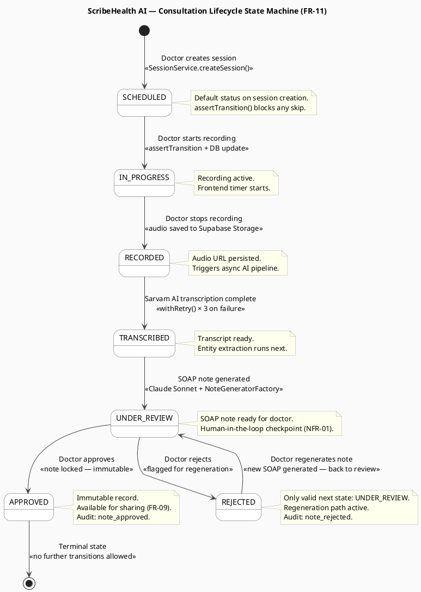
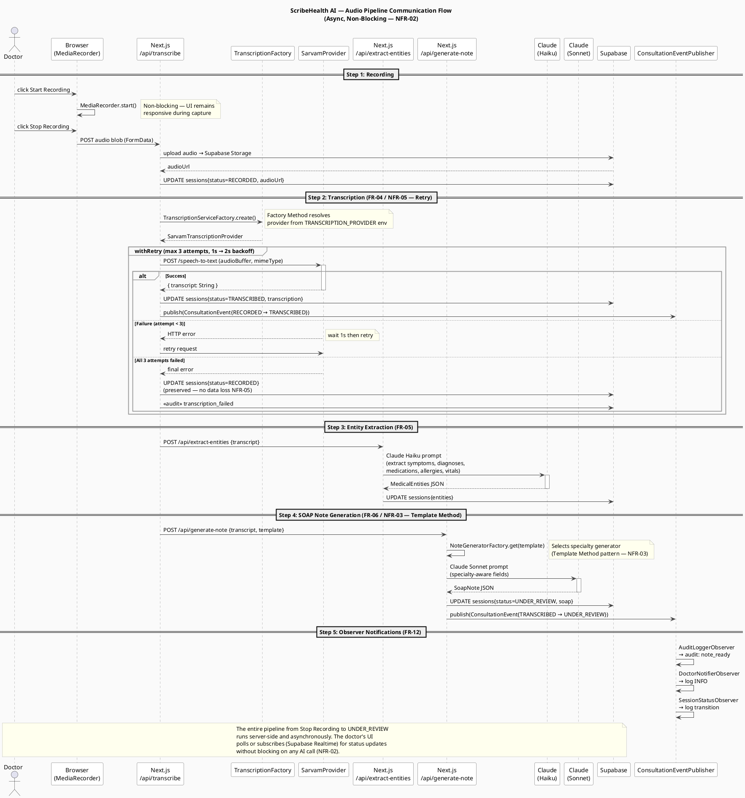

# Process View — State Machine & Audio Pipeline Async Flow

> **4+1 View: Process** — Shows runtime behaviour: the consultation lifecycle state machine and the asynchronous audio processing sequence.

---

## State Machine — Consultation Lifecycle (FR-11)

**What this shows:** The 7 legal states of a `ClinicalSession` and every permitted transition. This is directly implemented in two places: `ConsultationStateFactory` + concrete state classes on the Java backend (`lifecycle/state/`), and `VALID_TRANSITIONS` + `assertTransition()` in `lib/session-state-machine.ts` on the frontend. Both enforce the same rules independently — the backend is the source of truth, the frontend provides immediate UI feedback.

**Key constraints encoded in this diagram:**
- `APPROVED` is the only terminal state. Once a note is approved, `ApprovedState.transitionTo()` always throws `IllegalStateTransitionException`. There is no revert, no delete.
- `REJECTED → UNDER_REVIEW` is the only regeneration path. A rejected note cannot be directly approved — it must be regenerated, producing a new SOAP note, before the doctor can approve.
- The pipeline states `RECORDED → TRANSCRIBED → UNDER_REVIEW` are driven entirely by the AI pipeline (not by the doctor). Only `SCHEDULED → IN_PROGRESS → RECORDED` and `UNDER_REVIEW → APPROVED/REJECTED` are triggered by explicit doctor actions.
- Every transition fires a `ConsultationEvent` through the `ConsultationEventPublisher`, triggering all three registered observers.

---

## Communication Flow — Audio Pipeline (Async Sequence, FR-04 / NFR-02 / NFR-05)

**What this shows:** The runtime message flow across 10 participants for a single consultation, from the doctor clicking "Stop Recording" to the SOAP note appearing in UNDER_REVIEW. This is the most latency-sensitive path in the system and the one most directly shaped by NFR-02 (non-blocking) and NFR-05 (reliability).

**Key architectural decisions visible here:**
- **MediaRecorder → Supabase Storage** (Step 1): The audio blob is uploaded directly to Supabase Storage from the browser via the `/api/transcribe` route. The `audioUrl` is persisted to `sessions` immediately, ensuring the recording is never lost even if the pipeline fails mid-way.
- **`TranscriptionServiceFactory.create()`** (Step 2): The factory reads the `TRANSCRIPTION_PROVIDER` environment variable and returns a `SarvamTranscriptionProvider`. Swapping to Whisper or Google STT requires only a new class implementing `TranscriptionProvider` and a one-character env var change — no other code changes (NFR-03).
- **`withRetry()` group** (Step 2): Wraps the Sarvam API call with 3 attempts and linear backoff (1s → 2s). On final failure, the session status is left at `RECORDED` — the audio is preserved and the doctor can manually retry. The status is never advanced past `RECORDED` on failure, satisfying NFR-05.
- **Claude Haiku vs. Claude Sonnet** (Steps 3 & 4): Two different Claude models are used for different tasks. Haiku is faster and cheaper for structured JSON extraction (entity categories). Sonnet produces higher-quality prose for the specialty-aware SOAP note sections.
- **`NoteGeneratorFactory.get(template)`** (Step 4): Selects the correct `SoapNoteGenerator` subclass (e.g., `CardiologyNoteGenerator`) based on the template name. The `generate()` method is a Template Method — the abstract base class calls `callModel()` and `normaliseFields()` invariantly; subclasses override only `specialtyContext()` and `fields`.

