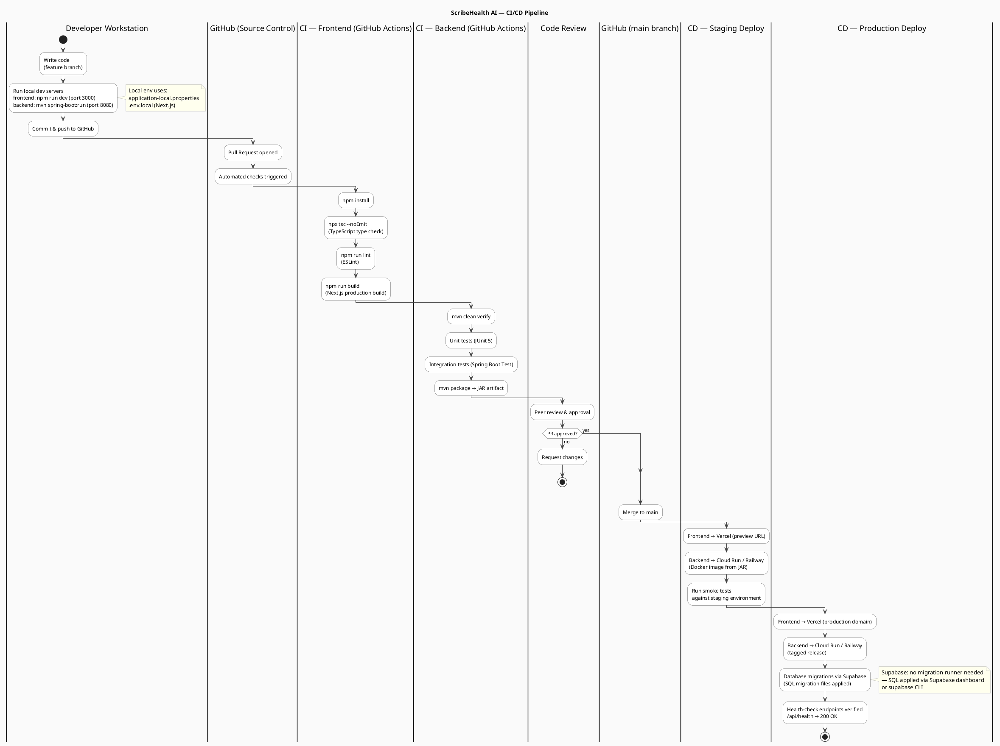

# Development View — CI/CD Pipeline & Package Structure

> **4+1 View: Development** — Shows how the codebase is organised into modules, and how the software is built, tested, and deployed.

---

## Package Structure Diagram

**What this shows:** The physical file and folder layout for both the `frontend/` (Next.js 16) and `backend/java/` (Spring Boot 3.2) codebases, annotated with which design pattern or architectural role each package serves.

**Frontend structure decisions:**
- `app/api/` contains Next.js API Route handlers — these are serverless functions that proxy to external AI services (Sarvam, Anthropic). They never run in the browser, so API keys (`SARVAM_API_KEY`, `ANTHROPIC_API_KEY`) are safe to use there.
- `lib/` is the core logic layer. Every pattern implementation lives here: `transcription-factory.ts` (Factory Method), `soap-note-generator.ts` (Template Method), `session-state-machine.ts` (State pattern mirror), `notifications.ts` (Observer notification templates). This layer has zero React dependencies — it can be unit-tested in isolation.
- `utils/supabase/` provides three separate Supabase clients: `client.ts` (browser context, uses anon key), `server.ts` (server components, uses service-role key read-only), `service.ts` (admin operations like audit log writes, bypasses RLS).
- `components/` key files: `session-recorder.tsx` wraps the browser `MediaRecorder` API; `soap-note-editor.tsx` renders the specialty-aware editable note fields; `prescription-tab.tsx` handles AI prescription fill + PDF generation + sharing.

**Backend structure decisions:**
- The `controller/` → `service/` → `repository/` layering is strictly enforced — controllers never call repositories directly.
- `lifecycle/` is split into `state/` and `observer/` subpackages. `state/` contains the pure state-machine logic (no Spring beans). `observer/` contains Spring `@Component`-annotated observers wired into the `ConsultationEventPublisher`.
- `facade/` contains only `AdminFacade` — a single Spring component that coordinates `UserService` + `AuditService` for all admin operations. `AdminController` delegates entirely to it.
- `dto/` classes are never annotated with `@Entity` — they are simple POJOs used only at the HTTP boundary. Model classes in `model/` are never exposed directly through controllers.

```plantuml
@startuml Development_Package_Structure
skinparam backgroundColor #FAFAFA
skinparam defaultFontName Arial
skinparam packageStyle rectangle
skinparam packageBorderColor #555
skinparam classBorderColor #666
skinparam arrowColor #444
skinparam classBackgroundColor #FFFFFF

title ScribeHealth AI — Development View: Package Structure

package "scribehealth-ai-project3 (root)" <<Rectangle>> #F5F5F5 {

  package "frontend/ (Next.js 16)" <<Rectangle>> #EAF4FB {
    package "app/" <<Rectangle>> #FFFFFF {
      package "app/api/" #FFFACD {
        class "auth/"           as Rauth   <<route>>
        class "sessions/"       as Rses    <<route>>
        class "patients/"       as Rpat    <<route>>
        class "transcribe/"     as Rtr     <<route>>
        class "generate-note/"  as Rgn     <<route>>
        class "extract-entities/" as Ree   <<route>>
        class "prescriptions/"  as Rpres   <<route>>
        class "admin/"          as Radm    <<route>>
        class "audit/"          as Raud    <<route>>
        class "notify/"         as Rnot    <<route>>
      }
      package "app/(pages)/" #F0F0FF {
        class "login/"          as Plogin  <<page>>
        class "dashboard/"      as Pdash   <<page>>
        class "patients/[id]/"  as Ppat    <<page>>
        class "sessions/[id]/"  as Pses    <<page>>
        class "admin/"          as Padm    <<page>>
      }
    }
    package "lib/" <<Rectangle>> #EAF7EA {
      class "auth.ts"                <<NextAuth config>>
      class "session-state-machine.ts" <<State pattern (FR-11)>>
      class "transcription-factory.ts" <<Factory Method (NFR-03)>>
      class "soap-note-generator.ts"   <<Template Method (NFR-03)>>
      class "notifications.ts"         <<Notification templates>>
      class "audit.ts"                 <<Client audit logger>>
      class "audit-server.ts"          <<Server audit logger>>
      class "mock-store.ts"            <<Zustand store>>
    }
    package "lib/types/" <<Rectangle>> #F5F5F5 {
      class "index.ts"   <<core domain types>>
    }
    package "components/" <<Rectangle>> #FFF8EE {
      class "session-recorder.tsx"   <<audio capture>>
      class "soap-note-editor.tsx"   <<review UI>>
      class "prescription-tab.tsx"   <<prescription UI>>
      class "audit-log-table.tsx"    <<admin UI>>
    }
    package "utils/supabase/" <<Rectangle>> #F5F5F5 {
      class "client.ts"   <<browser client>>
      class "server.ts"   <<server client>>
      class "service.ts"  <<service-role client>>
    }
  }

  package "backend/java/ (Spring Boot 3.2)" <<Rectangle>> #FFF0F5 {
    package "com.scribehealth" <<Rectangle>> #FFFFFF {
      package "controller/" #EAF4FB {
        class "AuthController"
        class "PatientController"
        class "SessionController"
        class "DoctorController"
        class "AdminController"
      }
      package "service/" #EAF7EA {
        class "AuthServiceImpl"
        class "PatientServiceImpl"
        class "SessionServiceImpl"
        class "AuditServiceImpl"
        class "UserServiceImpl"
        class "DoctorProfileServiceImpl"
      }
      package "model/" #FFFACD {
        class "User"
        class "Patient"
        class "ClinicalSession"
        class "AuditLog"
      }
      package "repository/" #F0F0FF {
        class "UserRepository"
        class "PatientRepository"
        class "SessionRepository"
        class "AuditLogRepository"
      }
      package "facade/" #FFF8EE {
        class "AdminFacade"   <<Facade Pattern>>
      }
      package "builder/" #FFF8EE {
        class "PatientProfileBuilder"   <<Builder Pattern>>
      }
      package "lifecycle/state/" #FFF0F5 {
        class "ConsultationState"       <<State Pattern>>
        class "ConsultationStateFactory"
      }
      package "lifecycle/observer/" #FFF0F5 {
        class "ConsultationEventPublisher"  <<Observer Pattern>>
        class "AuditLoggerObserver"
        class "DoctorNotifierObserver"
        class "SessionStatusObserver"
      }
      package "config/" #F5F5F5 {
        class "SecurityConfig"
        class "JwtAuthFilter"
      }
      package "util/" #F5F5F5 {
        class "JwtUtil"
      }
      package "dto/" #F5F5F5 {
        class "LoginRequest"
        class "RegisterRequest"
        class "AuthResponse"
        class "CreatePatientRequest"
      }
    }
  }

  package "docs/" <<Rectangle>> #EEEEEE {
    class "Architecture Framework/"  <<this folder>>
    class "Requirements & Subsystems/"
    class "ADRs/"
  }
}

@enduml
```

---

## CI/CD Pipeline Diagram

**What this shows:** The full build and deployment pipeline from a developer's local machine to production, using GitHub for source control and GitHub Actions for automation.

**Key pipeline decisions:**
- **Separate CI lanes for frontend and backend**: TypeScript type-check (`tsc --noEmit`) + ESLint + Next.js build runs independently of `mvn clean verify`. Either can fail without blocking the other, giving faster feedback.
- **Staging deploy on every PR**: Every pull request gets a Vercel preview URL (frontend) and a staging container (backend), so reviewers can test the full system before merging — not just review code.
- **Database schema changes**: Supabase does not use a traditional migration runner. Schema changes are applied via the Supabase dashboard or `supabase CLI` and committed as `.sql` files in the repo. This is a deliberate choice to keep schema management close to the platform.
- **Stateless Spring Boot container**: The JAR is containerised with Docker and deployed to Cloud Run or Railway. There is no local state — all persistent data goes through Supabase. This means horizontal scaling requires no coordination.
- **Health-check verification**: The final production deploy step hits `/api/health` on both the frontend (Next.js API route) and backend (Spring Boot Actuator or custom endpoint) before the deploy is considered complete.

