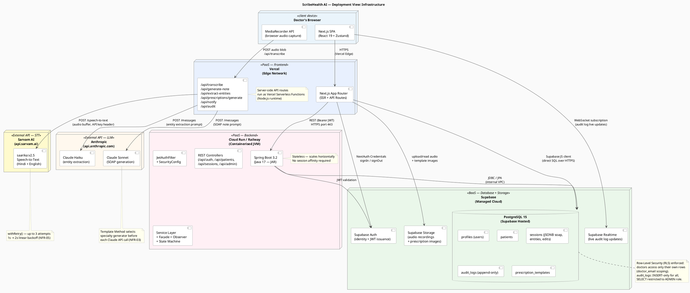

# Deployment View — Infrastructure Diagram

> **4+1 View: Deployment** — Shows the physical/cloud infrastructure: how Next.js, Spring Boot, Supabase, Sarvam AI, and Anthropic Claude are deployed and interconnected.

---

## Infrastructure Diagram

**What this shows:** All runtime nodes, their hosting tier, and every network connection between them — including protocol, direction, and what data crosses each link.

**Key infrastructure decisions:**
- **Vercel (Frontend + AI API Routes)**: The Next.js frontend and all AI-facing API routes (`/api/transcribe`, `/api/generate-note`, `/api/extract-entities`) are deployed to Vercel as serverless functions. This means AI API calls (to Sarvam and Anthropic) originate from Vercel's servers — never from the doctor's browser — keeping API keys secure and enabling `withRetry()` backoff without client timeout issues.
- **Spring Boot on Cloud Run / Railway**: The Java backend handles all business-logic REST calls (`/api/auth`, `/api/patients`, `/api/sessions`, `/api/admin`). It is stateless and containerised, communicating with Supabase over JDBC/JPA via an internal VPC connection (not public internet). JWT validation is also performed here using `JwtAuthFilter` before any request reaches a controller.
- **Dual database access paths**: Supabase PostgreSQL is accessed in two ways: (1) directly from the Next.js frontend using the Supabase JS client for fast CRUD (patient fetch, session updates) and (2) from the Spring Boot backend via JDBC/JPA for transactional operations. Row-Level Security (RLS) policies on Supabase enforce that each doctor can only read their own rows.
- **Supabase Realtime (WebSocket)**: The admin dashboard subscribes to `audit_logs` inserts via Supabase Realtime, displaying live audit events with sub-second latency without polling.
- **Supabase Auth as identity provider**: NextAuth 5 (frontend) uses the Credentials provider backed by `supabase.auth.signInWithPassword()`. The Spring Boot backend validates the resulting JWT using `JwtUtil` with a shared HMAC secret — it does not call Supabase Auth on every request.
- **Sarvam AI is called exclusively from the Vercel API route**: The audio blob from `MediaRecorder` is POSTed to `/api/transcribe`, which then streams it to `api.sarvam.ai`. The browser never calls Sarvam directly. This keeps the `SARVAM_API_KEY` server-side only.

---

## Deployment Node Summary

**What this shows:** A concise reference of every infrastructure node, its technology, and its specific role in ScribeHealth AI — useful for understanding the system's cloud cost structure and failure domains.

**Failure domain notes:**
- If **Sarvam AI** is unavailable, sessions stop at `RECORDED`. Audio is preserved. Doctor can retry manually. No data is lost (NFR-05).
- If **Anthropic Claude** is unavailable, SOAP note generation fails. The transcript is preserved in `TRANSCRIBED` state. Doctor can trigger regeneration later.
- If **Vercel** is unavailable, the full UI and AI pipeline are inaccessible. The Spring Boot backend remains up but has no client.
- If **Supabase** is unavailable, both the frontend and backend lose persistence. This is the single point of failure for the system — acceptable for a clinical documentation tool at this scale.

| Node | Technology | Role |
|---|---|---|
| **Vercel** | Next.js 16 (Edge + Serverless) | Frontend + API route layer |
| **Cloud Run / Railway** | Spring Boot 3.2 / Java 17 (Docker) | Core REST API + business logic |
| **Supabase PostgreSQL** | PostgreSQL 15 (managed) | Primary data store (JSONB for soap, entities, edits) |
| **Supabase Storage** | S3-compatible object store | Audio recordings + prescription template images |
| **Supabase Auth** | GoTrue (managed) | Identity provider + JWT issuance |
| **Supabase Realtime** | Phoenix Channels (WebSocket) | Live audit log streaming to admin dashboard |
| **Sarvam AI** | `saarika:v2.5` (Hindi/English STT) | External speech-to-text transcription |
| **Anthropic Claude** | Haiku (fast NLP) + Sonnet (quality SOAP) | Medical entity extraction + SOAP note generation |
