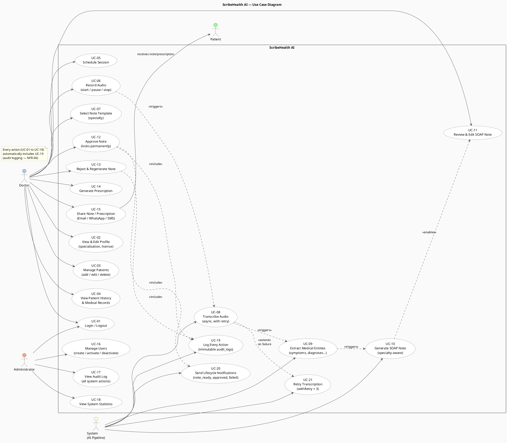
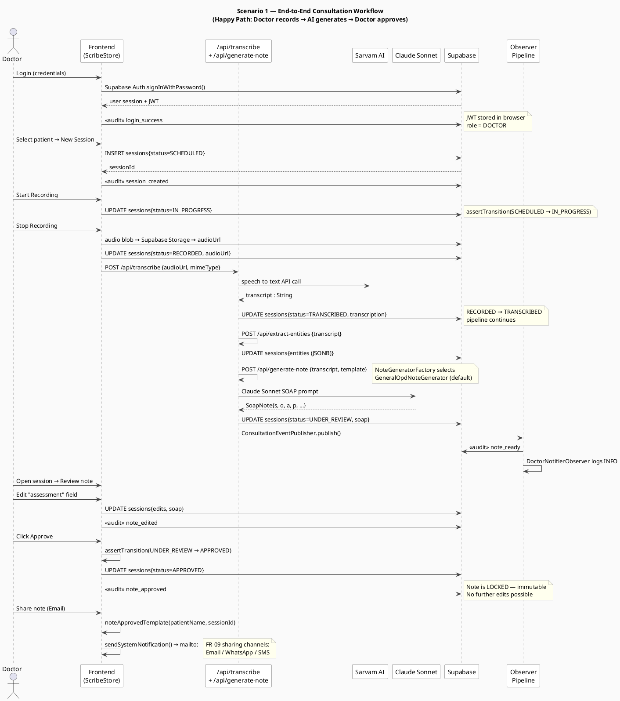

# Use Case View — Doctor, Admin & System Actors

> **4+1 View: Use Case (Scenarios)** — Illustrates key system scenarios from the user perspective and traces architecturally significant paths through the system.

---

## Use Case Diagram — All Actors

**What this shows:** All 21 use cases grouped by actor (Doctor, Admin, System, Patient). The System actor represents the automated AI pipeline — it has its own use cases (`UC-08` transcription, `UC-09` entity extraction, `UC-10` SOAP generation) because these run asynchronously without any doctor interaction.

**Key actor and relationship decisions:**
- **Doctor** initiates all consultation use cases (UC-05 through UC-15) but does not interact with the AI pipeline directly. The doctor triggers UC-06 (Record Audio) which `<<triggers>>` UC-08 through UC-10 automatically.
- **Admin** has a completely separate use-case surface (UC-16 to UC-18). The only overlap with Doctor is UC-01 (Login), reflecting that both roles authenticate through the same NextAuth flow but land in different dashboards.
- **Patient** is a passive actor — they only appear as a recipient of UC-15 (Share Note/Prescription). The patient never logs in to the system; they receive content via Email, WhatsApp, or SMS.
- **`UC-19` (Audit Logging)** is not directly invoked by any actor — it is `<<include>>`d by UC-12 and UC-13 and implicitly triggered by every state change. The note at the bottom of the diagram captures this: every UC-01 to UC-18 writes to `audit_logs`.
- **`UC-21` (Retry Transcription)** `<<extend>>`s UC-08 — it activates only on failure, not on the happy path. This correctly models `withRetry()` as an extension, not an inclusion.



---

## Scenario 1 — End-to-End: Record → Transcribe → SOAP → Approve

**What this shows:** The happy-path sequence for a complete consultation, from login through to note sharing. This scenario traces the full 7-state lifecycle in a single continuous flow, showing exactly which component handles each step and what is written to the database at each point.

**Architectural decisions highlighted in this scenario:**
- **Login writes an audit entry immediately**: `logAuditServer()` is called inside the NextAuth `signIn` event, not from any API route. This means the audit is captured at the identity layer — before the doctor even reaches the dashboard.
- **`assertTransition()` is called client-side before every `UPDATE`**: The frontend never blindly writes a new status. It calls `assertTransition(currentStatus, newStatus)` from `session-state-machine.ts` first, throwing an error if the transition is illegal. The backend state machine then validates again.
- **Observer pipeline fires at `UNDER_REVIEW`**: The `ConsultationEventPublisher` is invoked immediately after the SOAP note is persisted. The `AuditLoggerObserver` writes `note_ready` to `audit_logs`; `DoctorNotifierObserver` logs INFO. These are fire-and-forget — they do not block the API response.
- **Approval locks the note permanently**: After `UPDATE sessions{status=APPROVED}`, there is no API endpoint that allows a status change away from APPROVED. `ApprovedState.transitionTo()` always throws. The UI hides all edit controls once APPROVED is detected.
- **Sharing uses the browser's native URI schemes**: `noteApprovedTemplate()` constructs the email body, then `sendSystemNotification()` fires a `mailto:` URI (or `wa.me/` for WhatsApp, `sms:` for SMS). No email server is required — the doctor's installed mail client opens with a pre-filled message.



---

## Scenario 2 — Retry & Recovery: Transcription Failure

**What this shows:** The failure path for Step 2 (Sarvam AI transcription), demonstrating how `withRetry()` handles transient API errors and how the system degrades gracefully when all 3 attempts fail. This scenario directly addresses NFR-05 (Reliability).

**Key reliability guarantees demonstrated:**
- **Audio is always preserved before transcription is attempted**: The `audioUrl` is persisted to `sessions{status=RECORDED}` in Step 1, before the Sarvam API is ever called. Even if all 3 retry attempts fail, the doctor's recording is never lost.
- **Session status is never advanced on failure**: The failure branch explicitly leaves `status=RECORDED`. The system does not move the session to any error state — it stays at `RECORDED`, which is a valid retryable state. The doctor can trigger a fresh transcription attempt from the session detail page.
- **Backoff is linear (1s → 2s), not exponential**: This is a deliberate choice for a medical workflow. Exponential backoff could delay recovery by 30+ seconds; linear backoff with a max of 3 attempts keeps the failure fast and predictable.
- **`transcription_failed` is audited**: Even failures are logged. The admin can see from the audit log exactly which sessions experienced transcription errors, when, and how many attempts were made.
- **Graceful degradation message**: On final failure, the `transcriptionFailedTemplate()` notification body is prepared and shown to the doctor. The message includes the session ID so the doctor can locate and retry the correct session.

```plantuml
@startuml Scenario2_RetryReliability
skinparam backgroundColor #FAFAFA
skinparam defaultFontName Arial
skinparam sequenceArrowColor #444
skinparam sequenceParticipantBackgroundColor #FFFFFF
skinparam sequenceParticipantBorderColor #555
skinparam sequenceLifeLineBorderColor #888
skinparam noteBackgroundColor #FFFFEE
skinparam noteBorderColor #AAAAAA
skinparam sequenceGroupBorderColor #999

title Scenario 2 — Retry & Reliability\n(Transcription failure → withRetry() → recovery or graceful degradation)

actor "Doctor"        as D
participant "Frontend\n(ScribeStore)"   as FE
participant "/api/transcribe\n(withRetry wrapper)"  as API
participant "Sarvam AI"  as SAR
participant "Supabase"   as DB
participant "Observer\nPipeline"        as OBS

D -> FE : Stop Recording
FE -> DB : UPDATE sessions{status=RECORDED, audioUrl}
FE -> API : POST /api/transcribe {audioUrl}

note over API
  withRetry(fn, maxAttempts=3, baseDelayMs=1000)
  Attempt 1 → wait 1s on fail → Attempt 2 → wait 2s → Attempt 3
end note

group Attempt 1 of 3
  API -> SAR : POST /speech-to-text
  SAR --> API : 503 Service Unavailable
  note right : Sarvam AI transient error
  API -> API : wait 1 000ms…
end

group Attempt 2 of 3
  API -> SAR : POST /speech-to-text (retry)
  SAR --> API : 503 Service Unavailable
  note right : Error persists
  API -> API : wait 2 000ms…
end

group Attempt 3 of 3 — Success path
  API -> SAR : POST /speech-to-text (final retry)
  SAR --> API : 200 OK { transcript: String }
  note right : Recovery — pipeline continues normally
  API -> DB : UPDATE sessions{status=TRANSCRIBED, transcription}
  API -> OBS : publish(ConsultationEvent{RECORDED → TRANSCRIBED})
  OBS -> DB : <<audit>> session_transcribed
end

note over API, SAR : --- OR if all 3 attempts fail ---

group All 3 Attempts Failed — Graceful Degradation
  API -> DB : UPDATE sessions{status=RECORDED}\n(audio preserved — no data loss NFR-05)
  API -> DB : <<audit>> transcription_failed
  API -> OBS : publish(ConsultationEvent{error})
  OBS -> OBS : DoctorNotifierObserver\n→ transcriptionFailedTemplate()
  FE --> D : Show "Transcription failed — retry manually" UI
  note right : Audio is still stored safely.\nDoctor can retry from the session page.
end

note bottom of DB
  NFR-05 Reliability guarantee:
  The session status is NEVER advanced past RECORDED
  on failure. The audioUrl is always preserved.
  Doctor can trigger a fresh transcription attempt
  at any time from the session detail page.
end note

@enduml
```
