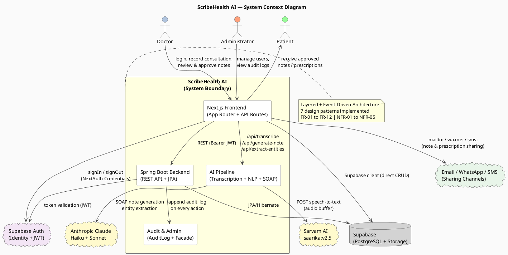
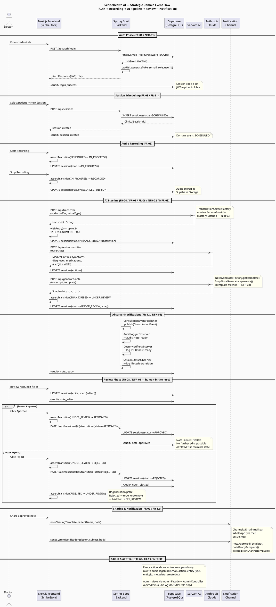

# ScribeHealth AI — System Overview Diagrams

---

## 1. System Context Diagram

> Shows ScribeHealth AI as a system boundary with all external actors and systems it interacts with.

---

## 2. Strategic Domain Event Flow

> Traces the complete event-driven lifecycle: **Auth → Session Recording → AI Pipeline → Review → Notification**

