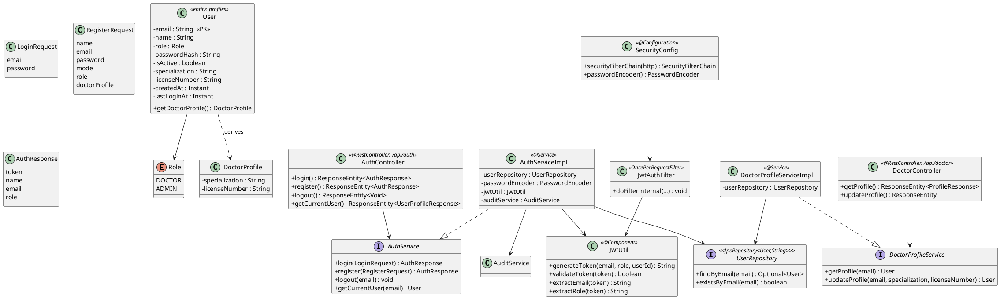
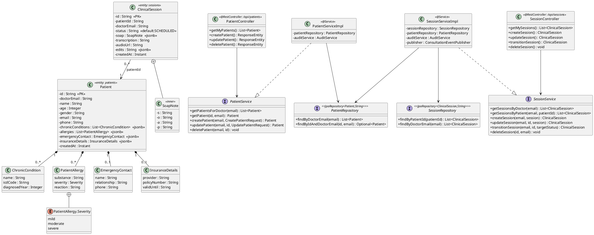
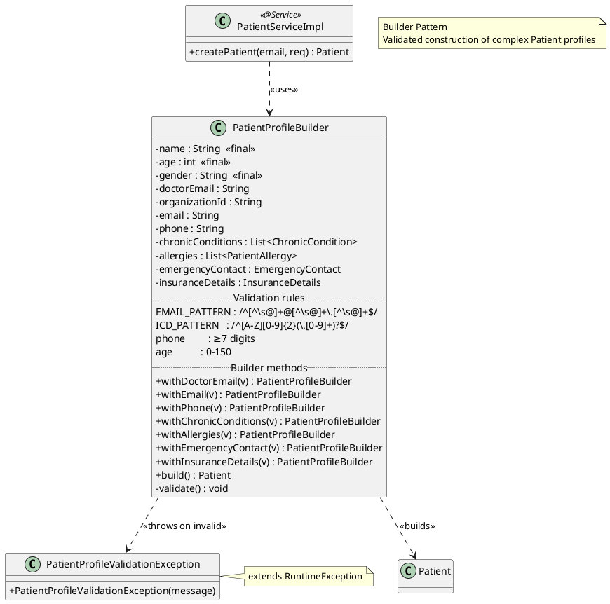
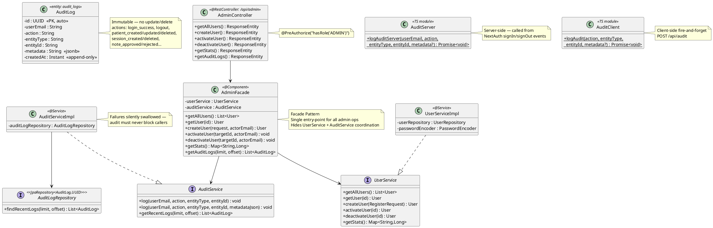
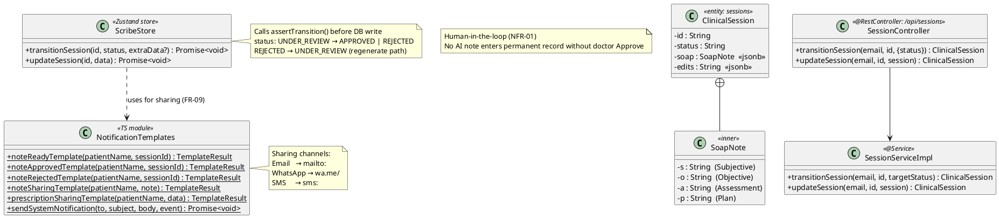
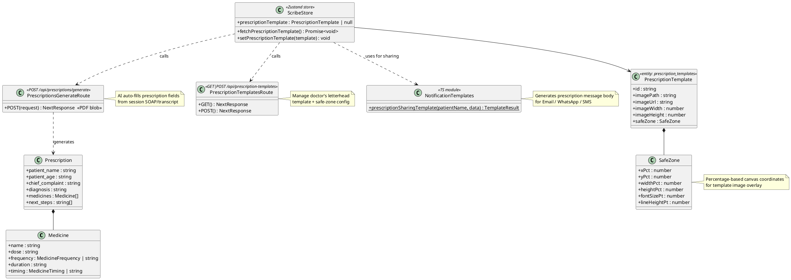

# ScribeHealth AI — Subsystem Class Diagrams

> Diagrams are scoped to architecturally significant classes, fields, and relationships.
> Boilerplate getters/setters are omitted. FRs and NFRs satisfied by each subsystem are annotated.

---

## 1. Auth & Access Subsystem
> **FR-01** (doctor login/register, role enforcement) · **FR-02** (admin management) · **NFR-01** (JWT security, TLS, 8-hr expiry)

---

## 2. Patient & Session Subsystem
> **FR-01** (doctor-scoped CRUD) · **FR-03** (session creation) · **FR-06** (SOAP note storage) · **FR-11** (status field) · **NFR-02** (CRUD under 500ms)

---

## 3. AI Pipeline Subsystem
> **FR-04** (async transcription + retry) · **FR-05** (entity extraction) · **FR-06** (SOAP generation) · **FR-07** (specialty templates) · **NFR-02** (non-blocking) · **NFR-03** (extensibility via patterns)

```plantuml
@startuml AI_Pipeline_Subsystem
skinparam classAttributeIconSize 0
skinparam packageStyle rectangle

note "Factory Method Pattern (NFR-03)\nNew provider = new class + 1 env var change" as NF

interface TranscriptionProvider {
  + name : string  <<readonly>>
  + transcribe(audioBuffer, mimeType?) : Promise<string>
}

class SarvamTranscriptionProvider {
  + name = "sarvam"
  - apiKey : string
  + transcribe(audioBuffer, mimeType?) : Promise<string>
}
note right : POST sarvam.ai/speech-to-text\nmodel: saarika:v2.5

class TranscriptionServiceFactory {
  + {static} create(provider?) : TranscriptionProvider
}
note right : Reads TRANSCRIPTION_PROVIDER env\nDefault = "sarvam"

note "Template Method Pattern (NFR-03)\nNew specialty = new subclass only" as NT

abstract class SoapNoteGenerator {
  + templateName : string  <<abstract>>
  + fields : string[]  <<abstract>>
  + generate(transcript, client: Anthropic) : Promise<Record<string,string>>
  # specialtyContext() : string
  - callModel(transcript, client) : Promise<Record<string,string>>
  - normaliseFields(raw) : Record<string,string>
}

class GeneralOpdNoteGenerator {
  templateName = "general_opd"
  fields = [subjective, objective, assessment,\ndiagnosis, prescription, advice, follow_up]
}
class MentalHealthNoteGenerator {
  templateName = "mental_health_soap"
  # specialtyContext() : string
}
class PhysiotherapyNoteGenerator {
  templateName = "physiotherapy"
  # specialtyContext() : string
}
class PediatricNoteGenerator {
  templateName = "pediatric"
  # specialtyContext() : string
}
class CardiologyNoteGenerator {
  templateName = "cardiology"
  # specialtyContext() : string
}
class SurgicalFollowupNoteGenerator {
  templateName = "surgical_followup"
  # specialtyContext() : string
}

class NoteGeneratorFactory {
  + {static} get(templateName) : SoapNoteGenerator
  + {static} templateNames() : string[]
}

interface MedicalEntities {
  + symptoms : string[]
  + diagnoses : string[]
  + medications : Array<{name,dosage,frequency}>
  + allergies : Array<{substance,severity}>
  + vitals : Array<{metric,value,unit}>
  + treatmentPlans : string[]
}

SarvamTranscriptionProvider ..|> TranscriptionProvider
TranscriptionServiceFactory ..> TranscriptionProvider : <<creates>>

GeneralOpdNoteGenerator --|> SoapNoteGenerator
MentalHealthNoteGenerator --|> SoapNoteGenerator
PhysiotherapyNoteGenerator --|> SoapNoteGenerator
PediatricNoteGenerator --|> SoapNoteGenerator
CardiologyNoteGenerator --|> SoapNoteGenerator
SurgicalFollowupNoteGenerator --|> SoapNoteGenerator
NoteGeneratorFactory ..> SoapNoteGenerator : <<selects>>
@enduml
```

---

## 4. Profile Builder Subsystem
> **FR-01** (patient record creation) · **NFR-01** (data integrity via validation before persistence)

---

## 5. Lifecycle & Notifications Subsystem
> **FR-11** (state transition enforcement) · **FR-12** (observer-driven notifications) · **NFR-04** (audit on every transition) · **NFR-05** (state persistence, no illegal jumps)

```plantuml
@startuml Lifecycle_Notifications_Subsystem
skinparam classAttributeIconSize 0
skinparam packageStyle rectangle

note "State Pattern (FR-11)\nIllegal transitions throw — APPROVED is terminal" as NS

interface ConsultationState {
  + statusName() : String
  + transitionTo(targetStatus) : ConsultationState
}

class ScheduledState {
  statusName() = "SCHEDULED"
  note: allows IN_PROGRESS
}
class InProgressState {
  statusName() = "IN_PROGRESS"
  note: allows RECORDED
}
class RecordedState {
  statusName() = "RECORDED"
  note: allows TRANSCRIBED
}
class TranscribedState {
  statusName() = "TRANSCRIBED"
  note: allows UNDER_REVIEW
}
class UnderReviewState {
  statusName() = "UNDER_REVIEW"
  note: allows APPROVED or REJECTED
}
class ApprovedState <<terminal>> {
  statusName() = "APPROVED"
}
class RejectedState {
  statusName() = "REJECTED"
  note: allows UNDER_REVIEW
}

class IllegalStateTransitionException {
  IllegalStateTransitionException(from, to)
}

class ConsultationStateFactory {
  + {static} fromStatus(status) : ConsultationState
}

ScheduledState   ..|> ConsultationState
InProgressState  ..|> ConsultationState
RecordedState    ..|> ConsultationState
TranscribedState ..|> ConsultationState
UnderReviewState ..|> ConsultationState
ApprovedState    ..|> ConsultationState
RejectedState    ..|> ConsultationState
ConsultationState ..> IllegalStateTransitionException : <<throws on invalid>>
ConsultationStateFactory ..> ConsultationState : <<creates>>

note "Observer Pattern (FR-12)\nPublisher notifies all subscribers on every transition" as NO

class ConsultationEvent {
  - sessionId : String
  - doctorEmail : String
  - fromStatus : String
  - toStatus : String
}

interface ConsultationObserver {
  + onEvent(event : ConsultationEvent) : void
}

class ConsultationEventPublisher {
  - observers : List<ConsultationObserver>
  + subscribe(observer) : void
  + unsubscribe(observer) : void
  + publish(event) : void
}

class AuditLoggerObserver {
  - auditService : AuditService
  + onEvent(event) : void
}
note right : toStatus → audit action\n(session_started, note_approved…)

class DoctorNotifierObserver {
  + onEvent(event) : void
}
note right : Logs INFO for\nUNDER_REVIEW, APPROVED, REJECTED

class SessionStatusObserver {
  + onEvent(event) : void
}
note right : Logs all lifecycle transitions

AuditLoggerObserver    ..|> ConsultationObserver
DoctorNotifierObserver ..|> ConsultationObserver
SessionStatusObserver  ..|> ConsultationObserver
ConsultationEventPublisher "1" o-- "0..*" ConsultationObserver
ConsultationEventPublisher ..> ConsultationEvent : publishes
AuditLoggerObserver --> AuditService

note "Frontend mirror (TypeScript)\nFR-11 enforced client-side too" as NTS
class SessionStateMachine <<TS module>> {
  + {static} VALID_TRANSITIONS : Record<SessionStatus, SessionStatus[]>
  + {static} canTransition(from, to) : boolean
  + {static} assertTransition(from, to) : void
}

class SessionServiceImpl <<@Service>> {
  + transitionSession(email, id, targetStatus) : ClinicalSession
}
SessionServiceImpl --> ConsultationStateFactory
SessionServiceImpl --> ConsultationEventPublisher
@enduml
```

---

## 6. Audit & Admin Subsystem
> **FR-02** (admin user management, audit dashboard) · **FR-10** (immutable action logging) · **NFR-04** (append-only audit, admin-only access)

---

## 7. Review & Sharing Subsystem
> **FR-08** (doctor review / approve / reject) · **FR-09** (note sharing via Email/WhatsApp/SMS) · **NFR-01** (no AI output without doctor approval) · **NFR-04** (every approval logged)

---

## 8. Prescription Generator Subsystem
> **FR-09** (prescription sharing) · **NFR-03** (template-based, extensible canvas layout)

