# Prompt for Teammate 1 — Architectural Tactics & Context Diagrams

## Context

You are working on the `report` branch of this repo:
`https://github.com/keshavdubeyy/scribehealth-ai-project3`

The `main` branch does NOT have the `docs/` architecture folders yet.
Your job: create all the files below, commit them in the 10 groups listed, then push to `main`.

## Setup

```bash
git clone https://github.com/keshavdubeyy/scribehealth-ai-project3.git
cd scribehealth-ai-project3
git checkout main
```

## Commit Plan

| # | Files | Commit message |
|---|-------|----------------|
| 1 | `docs/Architectural_Tactics_&_Patterns/1.C4_Context_Diagram.puml` | `docs: add C4 context diagram for ScribeHealth AI` |
| 2 | `docs/Architectural_Tactics_&_Patterns/2.C4_Container_Diagram.puml` | `docs: add C4 container diagram showing frontend/backend/AI pipeline` |
| 3 | `docs/Architectural_Tactics_&_Patterns/3.Component_Diagram_AI_Pipeline.puml` | `docs: add component diagram for AI pipeline (Factory + Template Method)` |
| 4 | `docs/Architectural_Tactics_&_Patterns/4.Sequence_Diagram_Sync_SOAP.puml`<br>`docs/Architectural_Tactics_&_Patterns/5.Sequence_Diagram_Async_Transcription.puml` | `docs: add sequence diagrams for SOAP generation and async transcription` |
| 5 | `docs/Architectural_Tactics_&_Patterns/6.Deployment_Diagram.puml` | `docs: add deployment diagram for dev and prod targets` |
| 6 | `docs/Architectural_Tactics_&_Patterns/7.Data_Model_Diagram.puml` | `docs: add data model diagram (patients, sessions, audit_logs, JSONB shapes)` |
| 7 | `docs/Architectural_Tactics_&_Patterns/8.Factory_Method_Pattern.puml`<br>`docs/Architectural_Tactics_&_Patterns/9.Template_Method_Pattern.puml` | `docs: add Factory Method and Template Method pattern diagrams` |
| 8 | `docs/Architectural_Tactics_&_Patterns/10.Observer_Pattern.puml`<br>`docs/Architectural_Tactics_&_Patterns/11.State_Pattern.puml` | `docs: add Observer and State pattern diagrams` |
| 9 | `docs/Architectural_Tactics_&_Patterns/Architectural Tactics & Patterns.md` | `docs: add architectural tactics and patterns markdown overview` |
| 10 | `docs/Requirements_&_Subsystems/Context and Event flow Diagrams/System_Context_Diagram.puml`<br>`docs/Requirements_&_Subsystems/Context and Event flow Diagrams/Strategic Domain Event Flow.puml` | `docs: add system context diagram and strategic domain event flow` |

---

## File Contents

### `docs/Architectural_Tactics_&_Patterns/1.C4_Context_Diagram.puml`

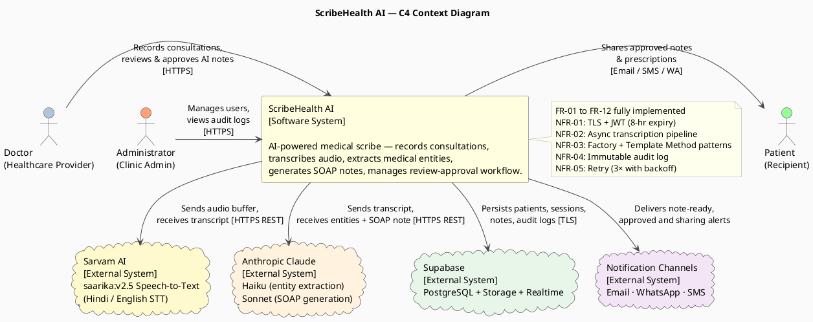

---

### `docs/Architectural_Tactics_&_Patterns/2.C4_Container_Diagram.puml`

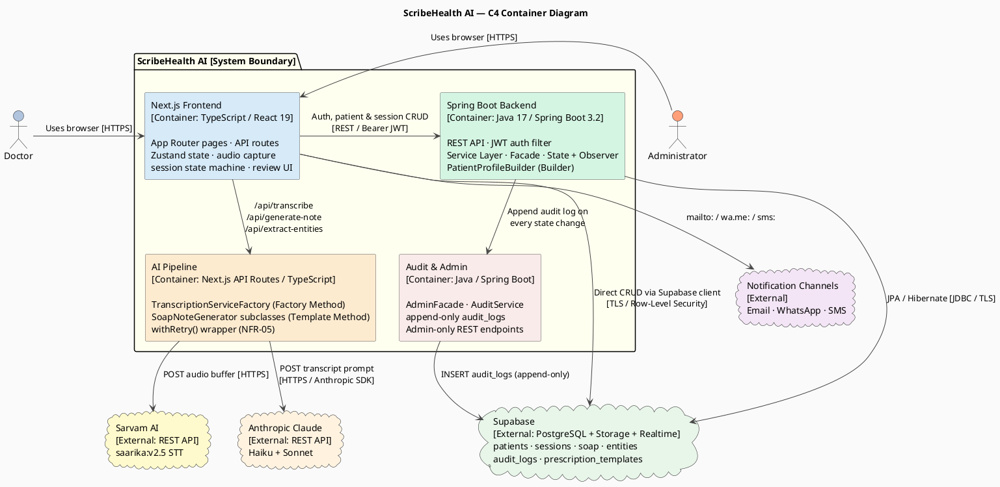

---

### `docs/Architectural_Tactics_&_Patterns/3.Component_Diagram_AI_Pipeline.puml`

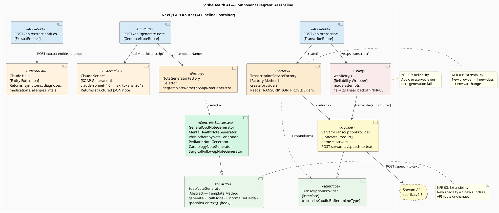

---

### `docs/Architectural_Tactics_&_Patterns/4.Sequence_Diagram_Sync_SOAP.puml`

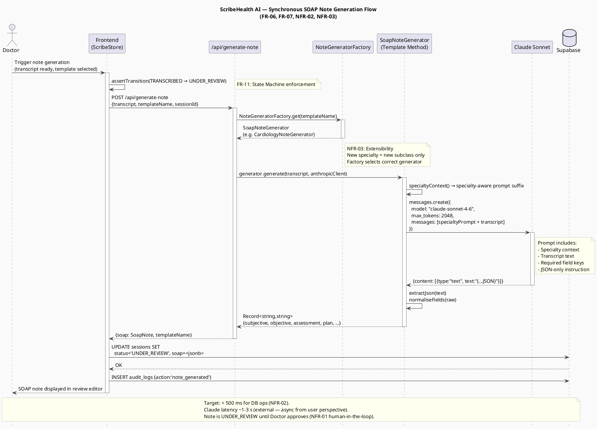

---

### `docs/Architectural_Tactics_&_Patterns/5.Sequence_Diagram_Async_Transcription.puml`

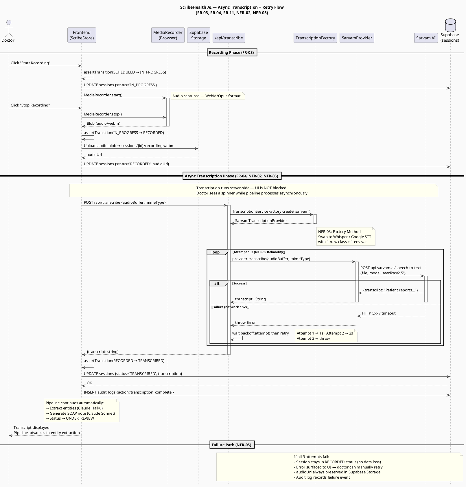

---

### `docs/Architectural_Tactics_&_Patterns/6.Deployment_Diagram.puml`

```plantuml
@startuml Deployment_Diagram
skinparam backgroundColor #FAFAFA
skinparam defaultFontName Arial
skinparam nodeBorderColor #555
skinparam arrowColor #444
skinparam componentBorderColor #777
skinparam noteBackgroundColor #FFFFEE
skinparam noteBorderColor #AAAAAA

title ScribeHealth AI — Deployment Diagram (Dev & Prod Targets)

' ─── DEVELOPMENT ──────────────────────────────────────────────
node "Developer Workstation\n[macOS / Linux]" as DEV #E8F5E9 {
  component "Next.js Dev Server\n(localhost:3000)\nnext dev · Hot reload" as FEDev
  component "Spring Boot\n(localhost:8080)\nmvn spring-boot:run · DevTools" as BEDev
  component "Environment: .env.local\nSARVAM_API_KEY · ANTHROPIC_API_KEY\nSUPABASE_URL · JWT_SECRET\nTRANSCRIPTION_PROVIDER=sarvam" as EnvDev
}

' ─── PRODUCTION ───────────────────────────────────────────────
node "Vercel Edge Network\n[Production Frontend]" as VERCEL #D6EAF8 {
  component "Next.js App Router\nServerless Functions (API Routes)\nEdge-cached static assets" as FEProd
  component "Env: SARVAM_API_KEY · ANTHROPIC_API_KEY\nSUPABASE_URL · SUPABASE_SERVICE_KEY\nNEXTAUTH_SECRET · NEXTAUTH_URL" as EnvProd
}

node "Cloud VM / Container Host\n[Production Backend]" as CLOUD #FDEBD0 {
  component "Spring Boot JAR\njava -jar scribehealth.jar\nJWT filter chain · Service Layer\nFacade · State + Observer patterns" as BEProd
}

' ─── EXTERNAL SERVICES ────────────────────────────────────────
cloud "Supabase Cloud\n[Managed PostgreSQL + Storage]" as SUPA #E8F5E9 {
  component "PostgreSQL\n(profiles · patients · sessions\naudit_logs · prescription_templates)" as PGDB
  component "Supabase Storage\n(audio recordings · prescription images)" as STG
  component "Supabase Realtime\n(audit log live feed)" as RT
}

cloud "Sarvam AI\n[api.sarvam.ai]" as SARVAM #FFFACD {
  component "saarika:v2.5\nSpeech-to-Text API" as STT
}

cloud "Anthropic API\n[api.anthropic.com]" as ANTHROPIC #FFF3E0 {
  component "claude-haiku-4-5\n(entity extraction)" as HAIKU
  component "claude-sonnet-4-6\n(SOAP generation)" as SONNET
}

' ─── DEV CONNECTIONS ──────────────────────────────────────────
FEDev -right-> BEDev : "REST / JWT [localhost:8080]"
FEDev -down->  PGDB  : "Supabase JS client [TLS]"
BEDev -down->  PGDB  : "JDBC / JPA [TLS]"
FEDev -right-> STT   : "POST audio [HTTPS]"
FEDev -right-> HAIKU  : "POST prompt [HTTPS]"
FEDev -right-> SONNET : "POST prompt [HTTPS]"

' ─── PROD CONNECTIONS ─────────────────────────────────────────
FEProd -down-> BEProd : "REST / Bearer JWT [HTTPS]"
FEProd -down-> PGDB   : "Supabase JS client [TLS / RLS]"
BEProd -down-> PGDB   : "JDBC / JPA [TLS]"
FEProd -right-> STT    : "POST audio buffer [HTTPS]"
FEProd -right-> HAIKU   : "POST entity-extraction [HTTPS]"
FEProd -right-> SONNET  : "POST SOAP generation [HTTPS]"
FEProd -down-> STG    : "Upload audio [HTTPS]"
FEProd -down-> RT     : "Subscribe audit feed [WebSocket]"

note bottom of SUPA
  NFR-01: TLS enforced at all layers
  NFR-04: audit_logs append-only (no UPDATE/DELETE)
  NFR-05: Supabase manages HA + backups
end note

note bottom of VERCEL
  NFR-02: Serverless lambdas scale to zero
  Cold start < 200ms for CRUD routes
  Static assets served from CDN edge
end note

@enduml

```

---

### `docs/Architectural_Tactics_&_Patterns/7.Data_Model_Diagram.puml`

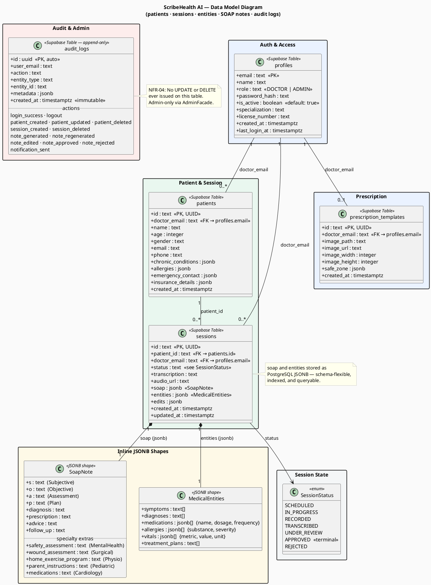

---

### `docs/Architectural_Tactics_&_Patterns/8.Factory_Method_Pattern.puml`

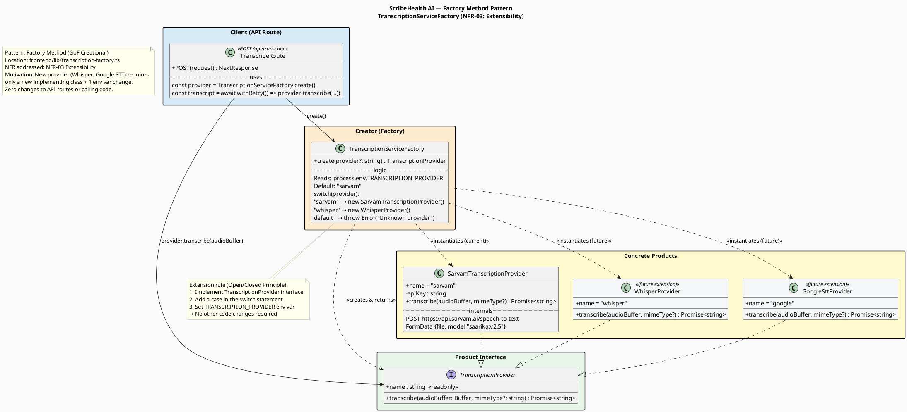

---

### `docs/Architectural_Tactics_&_Patterns/9.Template_Method_Pattern.puml`

```plantuml
@startuml Template_Method_Pattern
skinparam backgroundColor #FAFAFA
skinparam defaultFontName Arial
skinparam classAttributeIconSize 0
skinparam packageStyle rectangle
skinparam noteBackgroundColor #FFFFEE
skinparam noteBorderColor #AAAAAA
hide empty members

title ScribeHealth AI — Template Method Pattern\nSoapNoteGenerator (NFR-03: Extensibility)

note as N1
  Pattern: Template Method (GoF Behavioral)
  Location: frontend/lib/soap-note-generator.ts
  NFR addressed: NFR-03 Extensibility
  Motivation: All SOAP generators follow the same algorithm skeleton.
  Only specialty context and field list vary per template.
  New specialty = 1 new subclass. API route is never modified.
end note

package "Abstract Class (Template)" #E8F5E9 {
  abstract class SoapNoteGenerator {
    + {abstract} templateName : string
    + {abstract} fields : readonly string[]
    + generate(transcript, client: Anthropic) : Promise<Record<string,string>>
    .. Template Method — fixed skeleton ..
      1. specialtyContext() → context string
      2. callModel(transcript, client) → raw JSON
      3. normaliseFields(raw) → keyed result
    # specialtyContext() : string  <<hook — override in subclass>>
    - callModel(transcript, client) : Promise<Record<string,string>>  <<invariant>>
    - normaliseFields(raw) : Record<string,string>  <<invariant>>
  }
}

package "Concrete Subclasses" #FFFACD {
  class GeneralOpdNoteGenerator {
    + templateName = "general_opd"
    + fields = [subjective, objective, assessment,\n  diagnosis, prescription, advice, follow_up]
  }

  class MentalHealthNoteGenerator {
    + templateName = "mental_health_soap"
    + fields = [subjective, objective, assessment,\n  plan, safety_assessment]
    # specialtyContext() → "mental health and psychiatry"
  }

  class PhysiotherapyNoteGenerator {
    + templateName = "physiotherapy"
    + fields = [subjective, objective, assessment,\n  treatment, home_exercise_program, plan]
    # specialtyContext() → "physiotherapy and rehabilitation"
  }

  class PediatricNoteGenerator {
    + templateName = "pediatric"
    + fields = [subjective, objective, assessment,\n  plan, parent_instructions, follow_up]
    # specialtyContext() → "paediatrics"
  }

  class CardiologyNoteGenerator {
    + templateName = "cardiology"
    + fields = [subjective, objective, assessment,\n  plan, medications, follow_up]
    # specialtyContext() → "cardiology and cardiovascular medicine"
  }

  class SurgicalFollowupNoteGenerator {
    + templateName = "surgical_followup"
    + fields = [wound_assessment, subjective, objective,\n  assessment, plan, next_review]
    # specialtyContext() → "post-operative surgical follow-up"
  }

  class NewSpecialtyGenerator <<(future extension)>> #F4F6F7 {
    + templateName = "new_specialty"
    + fields = [...]
    # specialtyContext() → "..."
  }
}

package "Selector" #FDEBD0 {
  class NoteGeneratorFactory {
    - GENERATORS : SoapNoteGenerator[]
    + {static} get(templateName: string) : SoapNoteGenerator
    + {static} templateNames() : string[]
    .. logic ..
    GENERATORS.find(g => g.templateName === name)
    ?? new GeneralOpdNoteGenerator()
  }
}

package "Client" #D6EAF8 {
  class GenerateNoteRoute <<POST /api/generate-note>> {
    + POST(req) : NextResponse
    .. uses ..
    const gen = NoteGeneratorFactory.get(templateName)
    const soap = await gen.generate(transcript, anthropicClient)
  }
}

GeneralOpdNoteGenerator       --|> SoapNoteGenerator
MentalHealthNoteGenerator     --|> SoapNoteGenerator
PhysiotherapyNoteGenerator    --|> SoapNoteGenerator
PediatricNoteGenerator        --|> SoapNoteGenerator
CardiologyNoteGenerator       --|> SoapNoteGenerator
SurgicalFollowupNoteGenerator --|> SoapNoteGenerator
NewSpecialtyGenerator         --|> SoapNoteGenerator

NoteGeneratorFactory  ..> SoapNoteGenerator  : <<selects & returns>>
GenerateNoteRoute --> NoteGeneratorFactory    : "NoteGeneratorFactory.get(templateName)"
GenerateNoteRoute --> SoapNoteGenerator       : "gen.generate(transcript, client)"

note bottom of NoteGeneratorFactory
  Extension rule (Open/Closed Principle):
  1. Extend SoapNoteGenerator
  2. Set templateName + fields
  3. Override specialtyContext() if needed
  4. Add instance to GENERATORS array
  → Zero changes to API routes or calling code
end note

@enduml

```

---

### `docs/Architectural_Tactics_&_Patterns/10.Observer_Pattern.puml`

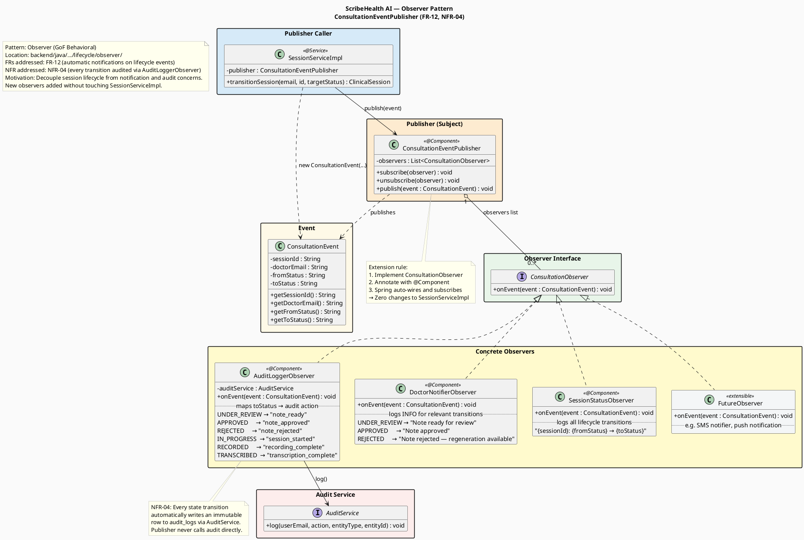

---

### `docs/Architectural_Tactics_&_Patterns/11.State_Pattern.puml`

```plantuml
@startuml State_Pattern
skinparam backgroundColor #FAFAFA
skinparam defaultFontName Arial
skinparam classAttributeIconSize 0
skinparam packageStyle rectangle
skinparam noteBackgroundColor #FFFFEE
skinparam noteBorderColor #AAAAAA
hide empty members

title ScribeHealth AI — State Pattern\nConsultation Lifecycle (FR-11, NFR-04, NFR-05)

note as N1
  Pattern: State (GoF Behavioral)
  Locations:
    Java — backend/java/.../lifecycle/state/
    TypeScript — frontend/lib/session-state-machine.ts
  FRs addressed: FR-11 (illegal transitions blocked), FR-12 (events on transition)
  NFRs addressed: NFR-04 (every transition audited), NFR-05 (state persisted)
  Motivation: Enforce 7-state consultation lifecycle as a first-class domain object.
  Illegal jumps throw IllegalStateTransitionException before any DB write.
end note

package "State Interface" #E8F5E9 {
  interface ConsultationState {
    + statusName() : String
    + transitionTo(targetStatus : String) : ConsultationState
  }
}

package "Concrete States" #FFFACD {
  class ScheduledState {
    + statusName() = "SCHEDULED"
    + transitionTo("IN_PROGRESS") : InProgressState
  }
  class InProgressState {
    + statusName() = "IN_PROGRESS"
    + transitionTo("RECORDED") : RecordedState
  }
  class RecordedState {
    + statusName() = "RECORDED"
    + transitionTo("TRANSCRIBED") : TranscribedState
  }
  class TranscribedState {
    + statusName() = "TRANSCRIBED"
    + transitionTo("UNDER_REVIEW") : UnderReviewState
  }
  class UnderReviewState {
    + statusName() = "UNDER_REVIEW"
    + transitionTo("APPROVED") : ApprovedState
    + transitionTo("REJECTED") : RejectedState
  }
  class ApprovedState <<terminal>> {
    + statusName() = "APPROVED"
    + transitionTo(any) → throw
  }
  class RejectedState {
    + statusName() = "REJECTED"
    + transitionTo("UNDER_REVIEW") : UnderReviewState
  }
}

package "Factory" #FDEBD0 {
  class ConsultationStateFactory {
    + {static} fromStatus(status : String) : ConsultationState
    .. switch(status) ..
    "SCHEDULED"    → new ScheduledState()
    "IN_PROGRESS"  → new InProgressState()
    "RECORDED"     → new RecordedState()
    "TRANSCRIBED"  → new TranscribedState()
    "UNDER_REVIEW" → new UnderReviewState()
    "APPROVED"     → new ApprovedState()
    "REJECTED"     → new RejectedState()
    default        → throw IllegalArgumentException
  }
}

package "Exception" #FDEDEC {
  class IllegalStateTransitionException {
    + IllegalStateTransitionException(from : String, to : String)
  }
}

package "Context (Service)" #D6EAF8 {
  class SessionServiceImpl <<@Service>> {
    + transitionSession(email, id, targetStatus) : ClinicalSession
    .. flow ..
    1. Load session from DB
    2. currentState = ConsultationStateFactory.fromStatus(session.status)
    3. nextState = currentState.transitionTo(targetStatus)
    4. session.status = nextState.statusName()
    5. sessionRepository.save(session)
    6. publisher.publish(ConsultationEvent)
  }
}

package "Frontend Mirror (TypeScript)" #EAF2FF {
  class SessionStateMachine <<TS module>> {
    + {static} VALID_TRANSITIONS : Record<SessionStatus, SessionStatus[]>
    .. SCHEDULED    → [IN_PROGRESS] ..
    .. IN_PROGRESS  → [RECORDED] ..
    .. RECORDED     → [TRANSCRIBED] ..
    .. TRANSCRIBED  → [UNDER_REVIEW] ..
    .. UNDER_REVIEW → [APPROVED, REJECTED] ..
    .. APPROVED     → []  (terminal) ..
    .. REJECTED     → [UNDER_REVIEW] ..
    + {static} canTransition(from, to) : boolean
    + {static} assertTransition(from, to) : void
  }
}

ScheduledState   ..|> ConsultationState
InProgressState  ..|> ConsultationState
RecordedState    ..|> ConsultationState
TranscribedState ..|> ConsultationState
UnderReviewState ..|> ConsultationState
ApprovedState    ..|> ConsultationState
RejectedState    ..|> ConsultationState

ConsultationState           ..> IllegalStateTransitionException : <<throws on invalid>>
ConsultationStateFactory    ..> ConsultationState              : <<creates>>
SessionServiceImpl --> ConsultationStateFactory                 : "fromStatus(session.status)"
SessionServiceImpl --> ConsultationState                        : "currentState.transitionTo(target)"

note right of ApprovedState
  NFR-05: APPROVED is terminal.
  No edit or transition permitted
  after approval. Note locked.
end note

note right of SessionStateMachine
  FR-11 enforced client-side too —
  assertTransition() called in ScribeStore
  before any API call.
end note

@enduml

```

---

### `docs/Architectural_Tactics_&_Patterns/Architectural Tactics & Patterns.md`

```markdown
# ScribeHealth AI — Architectural Tactics & Patterns

> Diagrams in this folder document how ScribeHealth AI satisfies its Non-Functional Requirements through concrete architectural tactics and GoF design patterns.
> Each `.puml` file is self-contained and renderable with PlantUML.

---

## Folder Contents

| # | File | Diagram Type | FRs / NFRs |
|---|------|-------------|-----------|
| 1 | `1.C4_Context_Diagram.puml` | C4 Context | FR-01–12 · NFR-01–05 |
| 2 | `2.C4_Container_Diagram.puml` | C4 Container | NFR-01, NFR-02, NFR-03 |
| 3 | `3.Component_Diagram_AI_Pipeline.puml` | Component | FR-04–07 · NFR-02, NFR-03, NFR-05 |
| 4 | `4.Sequence_Diagram_Sync_SOAP.puml` | Sequence | FR-06, FR-07, FR-11 · NFR-01, NFR-02, NFR-03 |
| 5 | `5.Sequence_Diagram_Async_Transcription.puml` | Sequence | FR-03, FR-04, FR-11 · NFR-02, NFR-03, NFR-05 |
| 6 | `6.Deployment_Diagram.puml` | Deployment | NFR-01, NFR-02, NFR-04, NFR-05 |
| 7 | `7.Data_Model_Diagram.puml` | Data Model | FR-01–12 · NFR-01, NFR-04 |
| 8 | `8.Factory_Method_Pattern.puml` | Class | NFR-03 |
| 9 | `9.Template_Method_Pattern.puml` | Class | NFR-03 |
| 10 | `10.Observer_Pattern.puml` | Class | FR-12 · NFR-04 |
| 11 | `11.State_Pattern.puml` | Class | FR-11 · NFR-04, NFR-05 |

---

## 1. C4 Context Diagram

**File:** `1.C4_Context_Diagram.puml`

Shows ScribeHealth AI as a black box within its environment, with all external actors and systems it interacts with.

**Actors:**
- **Doctor** — records consultations, reviews and approves AI-generated notes, manages patients
- **Administrator** — manages user accounts, views audit logs
- **Patient** — receives approved notes and prescriptions via Email/WhatsApp/SMS

**External Systems:**
- **Sarvam AI** (`saarika:v2.5`) — Hindi/English speech-to-text transcription
- **Anthropic Claude** (Haiku + Sonnet) — medical entity extraction and SOAP note generation
- **Supabase** — PostgreSQL database, file storage, and real-time feed
- **Notification Channels** — Email (`mailto:`), WhatsApp (`wa.me/`), SMS (`sms:`)

**Architectural significance:** Establishes the trust boundary — all PHI stays within the system boundary; only transcripts and prompts cross to AI APIs over TLS (NFR-01).

---

## 2. C4 Container Diagram

**File:** `2.C4_Container_Diagram.puml`

Decomposes ScribeHealth AI into four containers and shows how they communicate.

| Container | Technology | Role |
|-----------|-----------|------|
| Next.js Frontend | TypeScript / React 19 | UI, audio capture, state machine, review workflow |
| Spring Boot Backend | Java 17 / Spring Boot 3.2 | Auth, patient/session CRUD, state + observer patterns |
| AI Pipeline | Next.js API Routes (TypeScript) | Transcription factory, SOAP generator, retry wrapper |
| Audit & Admin | Java / Spring Boot | AdminFacade, append-only audit log, admin endpoints |

**Key tactic — Separation of Concerns (NFR-03):** Each pipeline stage (recording → transcription → NLP → generation) is an isolated container with a defined interface. The AI Pipeline container is independently deployable and can be swapped without touching the backend.

---

## 3. Component Diagram — AI Pipeline

**File:** `3.Component_Diagram_AI_Pipeline.puml`

Zooms into the AI Pipeline container to show the internal components and their interactions.

**Key components:**
- `TranscribeRoute` (`POST /api/transcribe`) — entry point for audio processing
- `TranscriptionServiceFactory` — Factory Method; selects provider from `TRANSCRIPTION_PROVIDER` env var
- `SarvamTranscriptionProvider` — concrete product; calls Sarvam AI REST API
- `withRetry()` — reliability wrapper; up to 3 attempts with 1s → 2s backoff (NFR-05)
- `NoteGeneratorFactory` — selects the correct `SoapNoteGenerator` subclass by template name
- `SoapNoteGenerator` — abstract Template Method base; `callModel()` and `normaliseFields()` are invariant
- Concrete generators (GeneralOPD, MentalHealth, Physio, Pediatric, Cardiology, SurgicalFollowup)

**Architectural significance:** All three extensibility axes (provider, template, fields) are isolated behind stable interfaces. The `GenerateNoteRoute` and `TranscribeRoute` API routes never change when new providers or specialties are added.

---

## 4. Sequence Diagram — Synchronous SOAP Note Generation

**File:** `4.Sequence_Diagram_Sync_SOAP.puml`

Traces the request path when a doctor triggers SOAP note generation after transcription.

**Flow:**
1. Doctor triggers generation; `assertTransition(TRANSCRIBED → UNDER_REVIEW)` validates the state (FR-11)
2. `POST /api/generate-note` resolves the correct generator via `NoteGeneratorFactory`
3. Generator builds a specialty-aware prompt and calls Claude Sonnet (`claude-sonnet-4-6`, max 2048 tokens)
4. Response is parsed via `extractJson()` and normalised — missing fields filled with `""`
5. Session status updated to `UNDER_REVIEW` and `note_generated` audit entry written

**NFR-02 performance target:** DB writes complete in < 500ms. Claude latency (~1–3s) is external and presented asynchronously to the user.
**NFR-01 human-in-the-loop:** The SOAP note is in `UNDER_REVIEW` — it cannot enter permanent records without explicit doctor approval.

---

## 5. Sequence Diagram — Async Transcription + Retry Flow

**File:** `5.Sequence_Diagram_Async_Transcription.puml`

Traces the full recording and transcription pipeline including the reliability retry mechanism.

**Flow:**
1. Doctor starts/stops recording; `MediaRecorder` captures audio as WebM/Opus blob
2. State machine enforces `SCHEDULED → IN_PROGRESS → RECORDED` transitions (FR-11)
3. Audio blob uploaded to Supabase Storage; `audioUrl` persisted on session
4. `POST /api/transcribe` invoked — transcription is server-side and non-blocking to the UI (NFR-02)
5. `TranscriptionServiceFactory.create()` returns the configured provider (NFR-03 Factory Method)
6. `withRetry()` attempts up to 3 calls to Sarvam AI with 1s → 2s linear backoff (NFR-05)
7. On success: session advances to `TRANSCRIBED`; pipeline continues to entity extraction
8. On total failure: session stays in `RECORDED`; `audioUrl` preserved; error surfaced to UI; no data lost

**NFR-05 reliability:** Even if note generation fails after a successful transcription, the transcript is already saved. The session can be retried from `RECORDED`.

---

## 6. Deployment Diagram

**File:** `6.Deployment_Diagram.puml`

Shows both the local development and production deployment targets.

**Development:**
- Next.js dev server on `localhost:3000`
- Spring Boot on `localhost:8080` with DevTools auto-restart
- All secrets in `.env.local`

**Production:**
- **Vercel** — Next.js serverless functions on a global CDN; API routes deployed as lambdas; static assets edge-cached
- **Cloud VM / Container** — Spring Boot JAR behind a TLS-terminating load balancer
- **Supabase Cloud** — managed PostgreSQL with HA, row-level security, Storage, and Realtime

**NFR-01:** TLS enforced at all network hops in production. No plaintext paths.
**NFR-02:** Vercel serverless cold starts < 200ms for CRUD; static assets from CDN edge.
**NFR-05:** Supabase manages backups and HA; Spring Boot runs behind a load balancer with health checks.

---

## 7. Data Model Diagram

**File:** `7.Data_Model_Diagram.puml`

Documents all persistent entities and their relationships.

| Entity | Storage | Purpose |
|--------|---------|---------|
| `profiles` | Supabase (PostgreSQL) | Doctor and admin accounts, role, JWT identity |
| `patients` | Supabase (PostgreSQL) | Patient demographics and medical history (JSONB) |
| `sessions` | Supabase (PostgreSQL) | Clinical sessions, status, transcription, SOAP, entities |
| `SoapNote` | JSONB column on `sessions` | Structured SOAP fields — base + specialty-specific |
| `MedicalEntities` | JSONB column on `sessions` | Extracted symptoms, diagnoses, medications, allergies, vitals |
| `audit_logs` | Supabase (PostgreSQL) | Append-only immutable action log |
| `prescription_templates` | Supabase (PostgreSQL + Storage) | Doctor letterhead image + safe-zone config |

**NFR-04:** `audit_logs` is append-only — no `UPDATE` or `DELETE` is ever issued. Accessible only via `AdminFacade` with `ADMIN` role.
**JSONB design:** `soap` and `entities` are stored as PostgreSQL JSONB — schema-flexible (supports all 6 specialty templates), indexed, and queryable.

---

## 8. Factory Method Pattern — TranscriptionServiceFactory

**File:** `8.Factory_Method_Pattern.puml`

**Pattern:** Factory Method (GoF Creational)
**Location:** `frontend/lib/transcription-factory.ts`
**NFR:** NFR-03 Extensibility

The Factory Method pattern decouples the AI Pipeline from any specific transcription vendor. The `TranscriptionProvider` interface is the product contract. `SarvamTranscriptionProvider` is the current concrete product. `TranscriptionServiceFactory.create()` reads `TRANSCRIPTION_PROVIDER` from the environment and instantiates the correct provider.

**Extension rule:** To add Whisper or Google STT:
1. Implement `TranscriptionProvider`
2. Add a `case` in `TranscriptionServiceFactory.create()`
3. Set `TRANSCRIPTION_PROVIDER=whisper` in the environment

No API routes, no calling code, and no other classes require modification.

---

## 9. Template Method Pattern — SoapNoteGenerator

**File:** `9.Template_Method_Pattern.puml`

**Pattern:** Template Method (GoF Behavioral)
**Location:** `frontend/lib/soap-note-generator.ts`
**NFR:** NFR-03 Extensibility

`SoapNoteGenerator` defines the fixed algorithm skeleton:
1. `specialtyContext()` — hook; subclass injects specialty-aware prompt suffix
2. `callModel()` — invariant; builds the Claude prompt, calls `claude-sonnet-4-6`, parses the response
3. `normaliseFields()` — invariant; ensures every declared field key is present in the result

Six concrete subclasses (GeneralOPD, MentalHealth, Physiotherapy, Pediatric, Cardiology, SurgicalFollowup) override only `templateName`, `fields`, and optionally `specialtyContext()`.

**Extension rule:** To add Dermatology or Ophthalmology:
1. Extend `SoapNoteGenerator`
2. Declare `templateName`, `fields`, and override `specialtyContext()`
3. Add instance to `GENERATORS` array in `NoteGeneratorFactory`

The `POST /api/generate-note` route is never modified.

---

## 10. Observer Pattern — ConsultationEventPublisher

**File:** `10.Observer_Pattern.puml`

**Pattern:** Observer (GoF Behavioral)
**Location:** `backend/java/…/lifecycle/observer/`
**FRs:** FR-12 (automatic notifications) · **NFRs:** NFR-04 (audit on every transition)

`ConsultationEventPublisher` is the subject. It holds a list of `ConsultationObserver` instances and calls `onEvent(ConsultationEvent)` on each when a session transitions state.

**Concrete observers:**
| Observer | Responsibility |
|----------|---------------|
| `AuditLoggerObserver` | Maps `toStatus` → audit action; writes to `audit_logs` via `AuditService` |
| `DoctorNotifierObserver` | Logs INFO-level notifications for `UNDER_REVIEW`, `APPROVED`, `REJECTED` |
| `SessionStatusObserver` | Logs all lifecycle transitions for debugging |

**Extension rule:** To add an SMS dispatcher or push notification sender, implement `ConsultationObserver`, annotate with `@Component`, and Spring auto-wires it. `SessionServiceImpl` and existing observers are untouched.

---

## 11. State Pattern — Consultation Lifecycle

**File:** `11.State_Pattern.puml`

**Pattern:** State (GoF Behavioral)
**Locations:** `backend/java/…/lifecycle/state/` · `frontend/lib/session-state-machine.ts`
**FRs:** FR-11 (illegal transitions blocked) · **NFRs:** NFR-04, NFR-05

The consultation lifecycle is modelled as a state machine with 7 states:

```
SCHEDULED → IN_PROGRESS → RECORDED → TRANSCRIBED → UNDER_REVIEW → APPROVED (terminal)
                                                               ↘ REJECTED → UNDER_REVIEW
```

**Java side:** `ConsultationState` interface; each concrete state class (`ScheduledState`, `InProgressState`, etc.) declares its allowed transitions and throws `IllegalStateTransitionException` on invalid ones. `ConsultationStateFactory` hydrates the correct state object from the persisted status string.

**TypeScript mirror:** `VALID_TRANSITIONS` map + `assertTransition()` enforces the same rules client-side in `ScribeStore` before any API call, preventing illegal UI-driven transitions.

**Key invariants:**
- `APPROVED` is terminal — `transitionTo()` always throws. Notes are permanently locked.
- `REJECTED → UNDER_REVIEW` is the only regeneration path.
- Every successful `transitionSession()` call fires `ConsultationEventPublisher.publish()`, which triggers the audit log observer (NFR-04).

```

---

### `docs/Requirements_&_Subsystems/Context and Event flow Diagrams/System_Context_Diagram.puml`

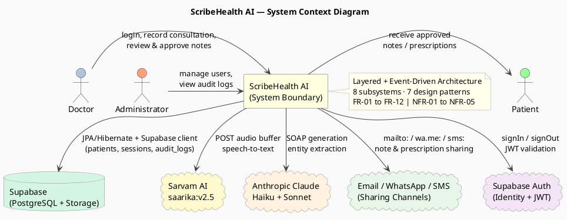

---

### `docs/Requirements_&_Subsystems/Context and Event flow Diagrams/Strategic Domain Event Flow.puml`

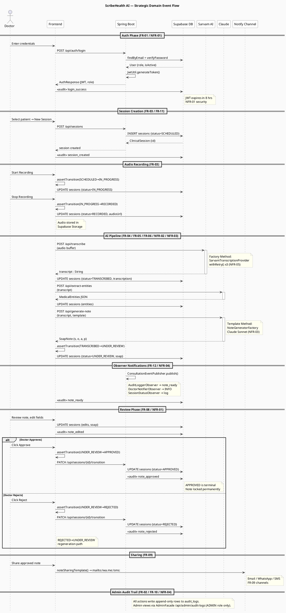

---

## How to commit

```bash
# For each commit group, create the files, then:
git add <files>
git commit -m "<message from table above>"

# After all 10 commits:
git push origin main
```
