# Prompt for Teammate 2 — Architecture Framework & Subsystems

## Context

You are working on the `report` branch of this repo:
`https://github.com/keshavdubeyy/scribehealth-ai-project3`

The `main` branch does NOT have the `docs/` architecture folders yet.
Your job: create all the files below, commit them in the 10 groups listed, then push to `main`.

## Setup

```bash
git clone https://github.com/keshavdubeyy/scribehealth-ai-project3.git
cd scribehealth-ai-project3
git checkout main
```

## Commit Plan

| # | Files | Commit message |
|---|-------|----------------|
| 1 | `docs/Architecture_Framework/1_Logical view/Package Diagram.puml`<br>`docs/Architecture_Framework/1_Logical view/Activity Diagram.puml`<br>`docs/Architecture_Framework/1_Logical view/1_Logical_View.md` | `docs: add logical view — package diagram and domain event flow activity` |
| 2 | `docs/Architecture_Framework/2_Process view/State_Machine.puml`<br>`docs/Architecture_Framework/2_Process view/Audio_Pipeline_Flow.puml`<br>`docs/Architecture_Framework/2_Process view/2_Process_View.md` | `docs: add process view — consultation lifecycle state machine and async pipeline` |
| 3 | `docs/Architecture_Framework/3_Development view/Package_Structure_Diagram.puml`<br>`docs/Architecture_Framework/3_Development view/CI_CD_Pipeline.puml`<br>`docs/Architecture_Framework/3_Development view/3_Development_View.md` | `docs: add development view — package structure and CI/CD pipeline` |
| 4 | `docs/Architecture_Framework/4_Deployment view/Infrastructure.puml`<br>`docs/Architecture_Framework/4_Deployment view/4_Deployment_View.md` | `docs: add deployment view — infrastructure diagram (Vercel + Spring Boot + Supabase)` |
| 5 | `docs/Architecture_Framework/5_Use Case Diagrams/All_Actors.puml`<br>`docs/Architecture_Framework/5_Use Case Diagrams/Scenario_1.puml`<br>`docs/Architecture_Framework/5_Use Case Diagrams/Scenario_2.puml`<br>`docs/Architecture_Framework/5_Use Case Diagrams/5_Use_Case_View.md` | `docs: add use case view — all actors, scenario 1 (happy path), scenario 2 (retry)` |
| 6 | `docs/Requirements_&_Subsystems/Subsystems/1.Auth & Access Subsystem.puml`<br>`docs/Requirements_&_Subsystems/Subsystems/2.Patient & Session Subsystem.puml` | `docs: add Auth & Access and Patient & Session subsystem diagrams` |
| 7 | `docs/Requirements_&_Subsystems/Subsystems/3.AI Pipeline Subsystem.puml`<br>`docs/Requirements_&_Subsystems/Subsystems/4.Profile Builder Subsystem.puml` | `docs: add AI Pipeline and Profile Builder subsystem diagrams` |
| 8 | `docs/Requirements_&_Subsystems/Subsystems/5.Lifecycle & Notifications Subsystem.puml`<br>`docs/Requirements_&_Subsystems/Subsystems/6.Audit & Admin Subsystem.puml` | `docs: add Lifecycle & Notifications and Audit & Admin subsystem diagrams` |
| 9 | `docs/Requirements_&_Subsystems/Subsystems/7.Review & Sharing Subsystem.puml`<br>`docs/Requirements_&_Subsystems/Subsystems/8.Prescription Generator Subsystem.puml` | `docs: add Review & Sharing and Prescription Generator subsystem diagrams` |
| 10 | `docs/Requirements_&_Subsystems/Subsystems/Subsystems.md` | `docs: add subsystems overview markdown` |

---

## File Contents

### `docs/Architecture_Framework/1_Logical view/Package Diagram.puml`

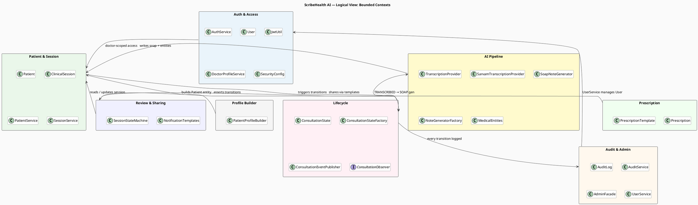

---

### `docs/Architecture_Framework/1_Logical view/Activity Diagram.puml`

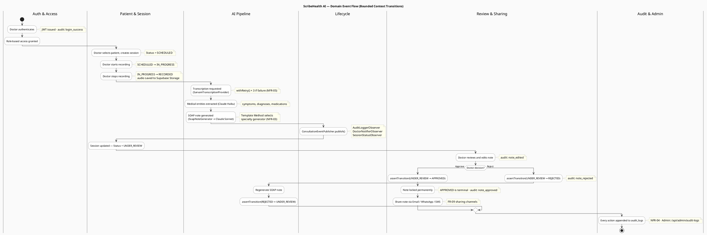

---

### `docs/Architecture_Framework/2_Process view/State_Machine.puml`

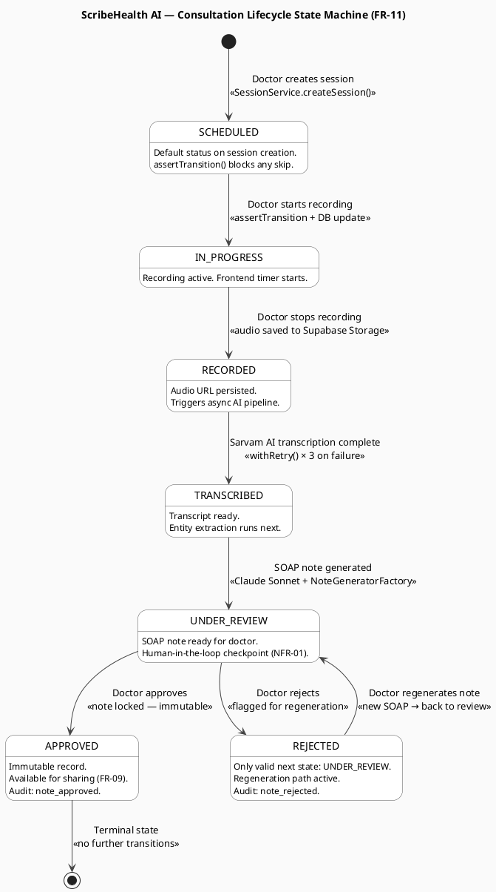

---

### `docs/Architecture_Framework/2_Process view/Audio_Pipeline_Flow.puml`

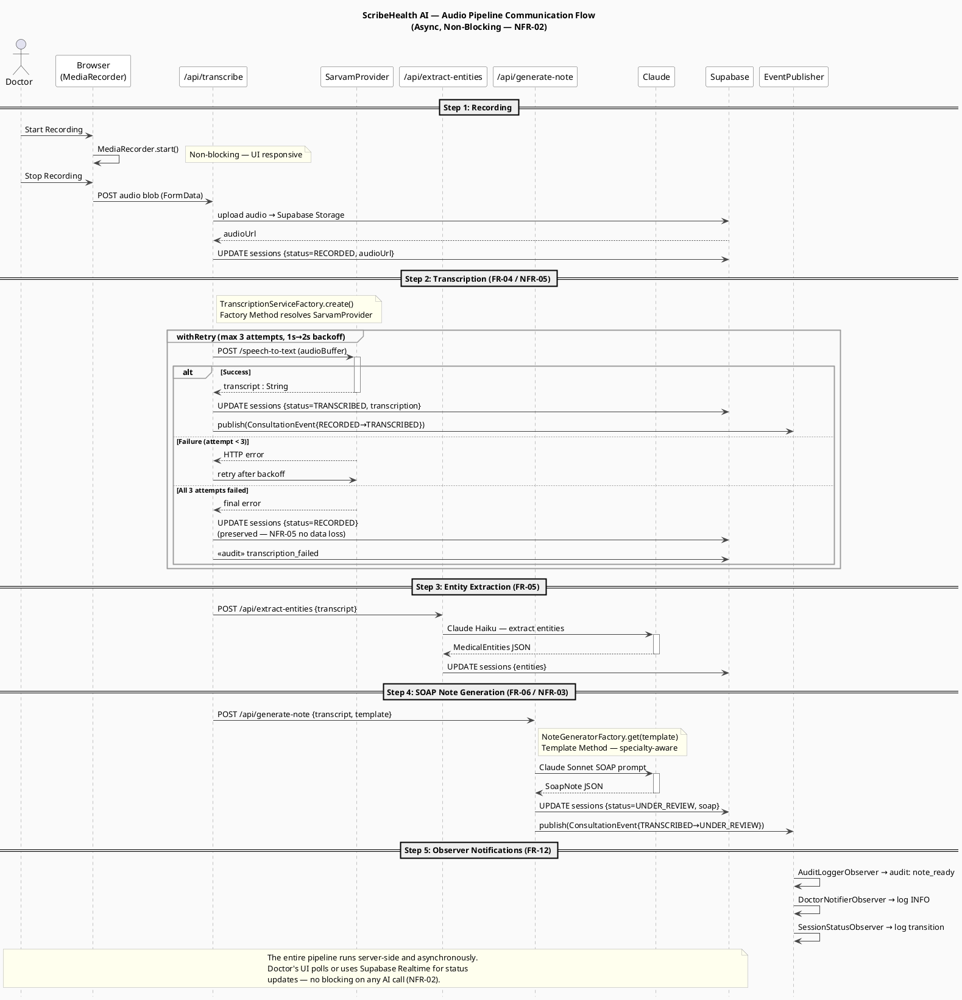

---

### `docs/Architecture_Framework/3_Development view/Package_Structure_Diagram.puml`

```plantuml
@startuml Development_Package_Structure
skinparam backgroundColor #FAFAFA
skinparam defaultFontName Arial
skinparam packageStyle rectangle
skinparam packageBorderColor #555
skinparam classBorderColor #666
skinparam arrowColor #444
skinparam classBackgroundColor #FFFFFF
hide empty members

title ScribeHealth AI — Development View: Package Structure

' ── Frontend ──────────────────────────────────────────────────
package "frontend/ (Next.js 16)" <<Rectangle>> #EAF4FB {

  package "app/api/" <<Rectangle>> #FFFACD {
    class "auth/"             as Rauth   <<route>>
    class "sessions/"         as Rses    <<route>>
    class "patients/"         as Rpat    <<route>>
    class "transcribe/"       as Rtr     <<route>>
    class "generate-note/"    as Rgn     <<route>>
    class "extract-entities/" as Ree     <<route>>
    class "prescriptions/"    as Rpres   <<route>>
    class "admin/"            as Radm    <<route>>
    class "audit/"            as Raud    <<route>>
    class "notify/"           as Rnot    <<route>>
  }

  package "app/(pages)/" <<Rectangle>> #F0F0FF {
    class "login/"         as Plogin <<page>>
    class "dashboard/"     as Pdash  <<page>>
    class "patients/[id]/" as Ppat   <<page>>
    class "sessions/[id]/" as Pses   <<page>>
    class "admin/"         as Padm   <<page>>
  }

  package "lib/" <<Rectangle>> #EAF7EA {
    class "auth.ts"                  <<NextAuth config>>
    class "session-state-machine.ts" <<State pattern>>
    class "transcription-factory.ts" <<Factory Method>>
    class "soap-note-generator.ts"   <<Template Method>>
    class "notifications.ts"         <<Notification templates>>
    class "audit.ts"                 <<Client audit logger>>
    class "audit-server.ts"          <<Server audit logger>>
    class "mock-store.ts"            <<Zustand store>>
  }

  package "lib/types/" <<Rectangle>> #F5F5F5 {
    class "index.ts" <<core domain types>>
  }

  package "components/" <<Rectangle>> #FFF8EE {
    class "session-recorder.tsx"  <<audio capture>>
    class "soap-note-editor.tsx"  <<review UI>>
    class "prescription-tab.tsx"  <<prescription UI>>
    class "audit-log-table.tsx"   <<admin UI>>
  }

  package "utils/supabase/" <<Rectangle>> #F5F5F5 {
    class "client.ts"  <<browser client>>
    class "server.ts"  <<server client>>
    class "service.ts" <<service-role client>>
  }
}

' ── Backend ───────────────────────────────────────────────────
package "backend/java/ (Spring Boot 3.2)" <<Rectangle>> #FFF0F5 {

  package "controller/" <<Rectangle>> #EAF4FB {
    class "AuthController"
    class "PatientController"
    class "SessionController"
    class "DoctorController"
    class "AdminController"
  }

  package "service/" <<Rectangle>> #EAF7EA {
    class "AuthServiceImpl"
    class "PatientServiceImpl"
    class "SessionServiceImpl"
    class "AuditServiceImpl"
    class "UserServiceImpl"
    class "DoctorProfileServiceImpl"
  }

  package "model/" <<Rectangle>> #FFFACD {
    class "User"
    class "Patient"
    class "ClinicalSession"
    class "AuditLog"
  }

  package "repository/" <<Rectangle>> #F0F0FF {
    class "UserRepository"
    class "PatientRepository"
    class "SessionRepository"
    class "AuditLogRepository"
  }

  package "facade/" <<Rectangle>> #FFF8EE {
    class "AdminFacade" <<Facade Pattern>>
  }

  package "builder/" <<Rectangle>> #FFF8EE {
    class "PatientProfileBuilder" <<Builder Pattern>>
  }

  package "lifecycle/state/" <<Rectangle>> #FFF0F5 {
    class "ConsultationState"       <<State Pattern>>
    class "ConsultationStateFactory"
  }

  package "lifecycle/observer/" <<Rectangle>> #FFF0F5 {
    class "ConsultationEventPublisher" <<Observer Pattern>>
    class "AuditLoggerObserver"
    class "DoctorNotifierObserver"
    class "SessionStatusObserver"
  }

  package "config/" <<Rectangle>> #F5F5F5 {
    class "SecurityConfig"
    class "JwtAuthFilter"
  }

  package "util/" <<Rectangle>> #F5F5F5 {
    class "JwtUtil"
  }

  package "dto/" <<Rectangle>> #F5F5F5 {
    class "LoginRequest"
    class "RegisterRequest"
    class "AuthResponse"
    class "CreatePatientRequest"
  }
}

' ── Docs ──────────────────────────────────────────────────────
package "docs/" <<Rectangle>> #EEEEEE {
  class "Architecture Framework/"     <<this folder>>
  class "Requirements & Subsystems/"
  class "Architectural Tactics & Patterns/"
}

@enduml

```

---

### `docs/Architecture_Framework/3_Development view/CI_CD_Pipeline.puml`

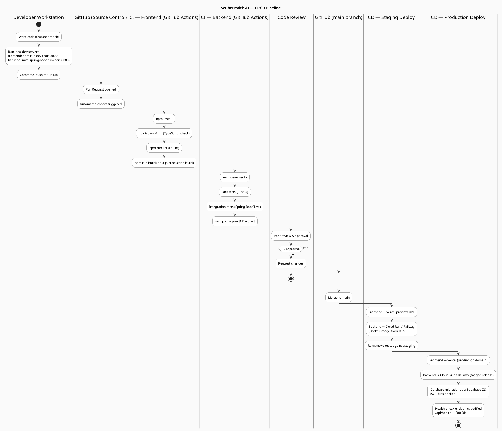

---

### `docs/Architecture_Framework/4_Deployment view/Infrastructure.puml`

```plantuml
@startuml Deployment_View
skinparam backgroundColor #FAFAFA
skinparam defaultFontName Arial
skinparam nodeBorderColor #555
skinparam nodeBackgroundColor #FFFFFF
skinparam arrowColor #444
skinparam componentBorderColor #666
skinparam componentBackgroundColor #FFFFFF
skinparam noteBackgroundColor #FFFFEE
skinparam noteBorderColor #AAAAAA
skinparam packageBorderColor #888

title ScribeHealth AI — Deployment View: Infrastructure

' ── Doctor's Browser ──────────────────────────────────────────
node "Doctor's Browser" <<client device>> #EAF4FB {
  component "Next.js SPA\n(React 19 + Zustand)" as SPA
  component "MediaRecorder API\n(browser audio capture)" as MR
}

' ── Vercel (Frontend Hosting) ─────────────────────────────────
node "Vercel (Edge Network)" <<PaaS — Frontend>> #E8F0FE {
  component "Next.js App Router\n(SSR + API Routes)" as NEXT
  component "Serverless API Routes\n(/api/transcribe · /api/generate-note\n/api/extract-entities · /api/notify\n/api/prescriptions · /api/audit)" as ROUTES
}

' ── Cloud Run / Railway (Backend) ─────────────────────────────
node "Cloud Run / Railway (JVM)" <<PaaS — Backend>> #FFF0F5 {
  component "Spring Boot 3.2 (Java 17)" as SB
  component "JwtAuthFilter + SecurityConfig" as SEC
  component "REST Controllers\n(/api/auth · /api/patients\n/api/sessions · /api/admin)" as API
  component "Service Layer\n(Facade · Observer · State Machine)" as SVC
}

' ── Supabase ──────────────────────────────────────────────────
node "Supabase (Managed Cloud)" <<BaaS — DB + Storage>> #EAF7EA {
  component "PostgreSQL 15\n(profiles · patients · sessions\naudit_logs · prescription_templates)" as PG
  component "Supabase Storage\n(audio recordings + prescription images)" as STG
  component "Supabase Auth\n(identity + JWT issuance)" as AUTH
  component "Supabase Realtime\n(live audit log updates)" as RT
}

' ── External AI Services ──────────────────────────────────────
node "Sarvam AI (api.sarvam.ai)" <<External API — STT>> #FFFACD {
  component "saarika:v2.5\nSpeech-to-Text (Hindi + English)" as SARVAM
}

node "Anthropic (api.anthropic.com)" <<External API — LLM>> #FFF8EE {
  component "Claude Haiku (entity extraction)" as HAIKU
  component "Claude Sonnet (SOAP generation)" as SONNET
}

' ── Connections ───────────────────────────────────────────────
SPA     -right-> NEXT    : HTTPS (Vercel Edge)
MR      -right-> ROUTES  : POST audio blob\n/api/transcribe

NEXT    -down->  SB      : REST (Bearer JWT) HTTPS
SB      -right-> PG      : JDBC / JPA (internal VPC)
NEXT    -down->  PG      : Supabase JS client (direct SQL)
NEXT    -down->  STG     : upload / read audio + images
NEXT    -down->  AUTH    : NextAuth signIn / signOut
SB      -down->  AUTH    : JWT validation

ROUTES  -right-> SARVAM  : POST /speech-to-text
ROUTES  -right-> HAIKU   : POST /messages (entity extraction)
ROUTES  -right-> SONNET  : POST /messages (SOAP generation)

SPA     -down->  RT      : WebSocket (audit log live updates)

note right of ROUTES : Serverless Functions\n(Node.js runtime)
note right of SB : Stateless — scales horizontally\nNo session affinity required

note bottom of PG
  Row-Level Security (RLS): doctors access only their own rows.
  audit_logs: INSERT-only for all, SELECT restricted to ADMIN.
end note

note bottom of SARVAM
  withRetry() — up to 3 attempts
  1s → 2s linear backoff (NFR-05)
end note

note bottom of SONNET
  Template Method selects specialty
  generator before each API call (NFR-03)
end note

@enduml

```

---

### `docs/Architecture_Framework/5_Use Case Diagrams/All_Actors.puml`

```plantuml
@startuml UseCase_Diagram
skinparam backgroundColor #FAFAFA
skinparam defaultFontName Arial
skinparam usecaseBorderColor #555
skinparam usecaseBackgroundColor #FFFFFF
skinparam actorBorderColor #333
skinparam arrowColor #444
skinparam noteBackgroundColor #FFFFEE
skinparam noteBorderColor #AAAAAA

title ScribeHealth AI — Use Case Diagram

top to bottom direction

actor "Doctor"               as DR  #LightSteelBlue
actor "Administrator"        as AD  #LightSalmon
actor "System\n(AI Pipeline)" as SYS #LightYellow
actor "Patient"              as PAT #PaleGreen

rectangle "ScribeHealth AI" {

  ' ── Auth & Profile ───────────────────────────────────────────
  usecase "UC-01\nLogin / Logout"                        as UC01
  usecase "UC-02\nView & Edit Profile\n(specialization)" as UC02

  ' ── Patient Management ───────────────────────────────────────
  usecase "UC-03\nManage Patients\n(add / edit / delete)"   as UC03
  usecase "UC-04\nView Patient History\n& Medical Records"  as UC04

  ' ── Consultation Lifecycle ───────────────────────────────────
  usecase "UC-05\nSchedule Session"                      as UC05
  usecase "UC-06\nRecord Audio\n(start / pause / stop)"  as UC06
  usecase "UC-07\nSelect Note Template\n(specialty)"     as UC07

  ' ── AI Pipeline ──────────────────────────────────────────────
  usecase "UC-08\nTranscribe Audio\n(async, with retry)" as UC08
  usecase "UC-09\nExtract Medical Entities"              as UC09
  usecase "UC-10\nGenerate SOAP Note\n(specialty-aware)" as UC10

  ' ── Review ───────────────────────────────────────────────────
  usecase "UC-11\nReview & Edit SOAP Note"               as UC11
  usecase "UC-12\nApprove Note\n(locks permanently)"     as UC12
  usecase "UC-13\nReject & Regenerate Note"              as UC13

  ' ── Sharing ──────────────────────────────────────────────────
  usecase "UC-14\nGenerate Prescription"                 as UC14
  usecase "UC-15\nShare Note / Prescription\n(Email / WhatsApp / SMS)" as UC15

  ' ── Admin ────────────────────────────────────────────────────
  usecase "UC-16\nManage Users\n(create / activate / deactivate)" as UC16
  usecase "UC-17\nView Audit Log\n(all system actions)"   as UC17
  usecase "UC-18\nView System Statistics"                 as UC18

  ' ── System (automated) ───────────────────────────────────────
  usecase "UC-19\nLog Every Action\n(immutable audit_logs)" as UC19
  usecase "UC-20\nSend Lifecycle Notifications\n(note_ready, approved, failed)" as UC20
  usecase "UC-21\nRetry Transcription\n(withRetry × 3)"    as UC21
}

' Doctor associations
DR --> UC01
DR --> UC02
DR --> UC03
DR --> UC04
DR --> UC05
DR --> UC06
DR --> UC07
DR --> UC11
DR --> UC12
DR --> UC13
DR --> UC14
DR --> UC15

' Admin associations
AD --> UC01
AD --> UC16
AD --> UC17
AD --> UC18

' System (automated pipeline) associations
SYS --> UC08
SYS --> UC09
SYS --> UC10
SYS --> UC19
SYS --> UC20
SYS --> UC21

' Patient (passive — recipient)
UC15 --> PAT : receives note/prescription

' Trigger / include / extend relationships
UC06 ..> UC08 : <<triggers>>
UC08 ..> UC09 : <<triggers>>
UC09 ..> UC10 : <<triggers>>
UC10 ..> UC11 : <<enables>>
UC12 ..> UC19 : <<include>>
UC13 ..> UC19 : <<include>>
UC08 ..> UC21 : <<extend>>\non failure
UC12 ..> UC20 : <<include>>

note "Every action (UC-01 to UC-18)\nautomatically triggers UC-19\n(audit logging — NFR-04)" as N1

@enduml

```

---

### `docs/Architecture_Framework/5_Use Case Diagrams/Scenario_1.puml`

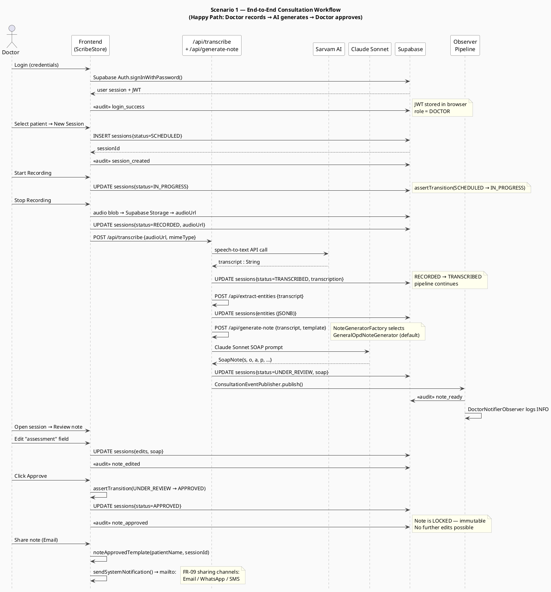

---

### `docs/Architecture_Framework/5_Use Case Diagrams/Scenario_2.puml`

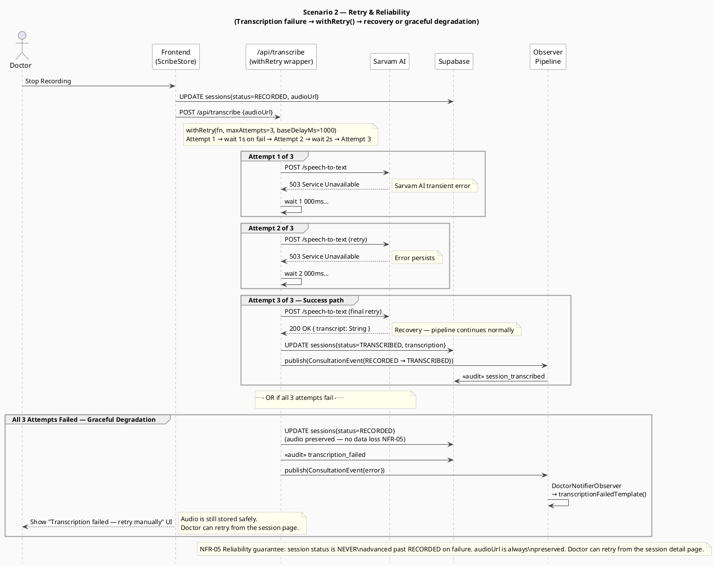

---

### `docs/Requirements_&_Subsystems/Subsystems/1.Auth & Access Subsystem.puml`

```plantuml
@startuml Auth_Access_Subsystem
skinparam backgroundColor #FAFAFA
skinparam defaultFontName Arial
skinparam classAttributeIconSize 0
skinparam packageStyle rectangle
skinparam noteBackgroundColor #FFFFEE
skinparam noteBorderColor #AAAAAA
hide empty members

enum Role { 
  DOCTOR
  ADMIN
}

class User <<entity: profiles>> {
  - email : String  <<PK>>
  - name : String
  - role : Role
  - passwordHash : String
  - isActive : boolean
  - specialization : String
  - licenseNumber : String
  - createdAt : Instant
  - lastLoginAt : Instant
  + getDoctorProfile() : DoctorProfile
}

class DoctorProfile {
  - specialization : String
  - licenseNumber : String
}

class JwtUtil <<@Component>> {
  + generateToken(email, role, userId) : String
  + validateToken(token) : boolean
  + extractEmail(token) : String
  + extractRole(token) : String
}

class JwtAuthFilter <<OncePerRequestFilter>> {
  + doFilterInternal(...) : void
}

class SecurityConfig <<@Configuration>> {
  + securityFilterChain(http) : SecurityFilterChain
  + passwordEncoder() : PasswordEncoder
}

interface AuthService {
  + login(LoginRequest) : AuthResponse
  + register(RegisterRequest) : AuthResponse
  + logout(email) : void
  + getCurrentUser(email) : User
}

class AuthServiceImpl <<@Service>> {
  - userRepository : UserRepository
  - passwordEncoder : PasswordEncoder
  - jwtUtil : JwtUtil
  - auditService : AuditService
}

interface DoctorProfileService {
  + getProfile(email) : User
  + updateProfile(email, specialization, licenseNumber) : User
}

class DoctorProfileServiceImpl <<@Service>> {
  - userRepository : UserRepository
}

interface UserRepository <<JpaRepository<User,String>>> {
  + findByEmail(email) : Optional<User>
  + existsByEmail(email) : boolean
}

class AuthController <<@RestController: /api/auth>> {
  + login() : ResponseEntity<AuthResponse>
  + register() : ResponseEntity<AuthResponse>
  + logout() : ResponseEntity<Void>
  + getCurrentUser() : ResponseEntity<UserProfileResponse>
}

class DoctorController <<@RestController: /api/doctor>> {
  + getProfile() : ResponseEntity<ProfileResponse>
  + updateProfile() : ResponseEntity
}

' DTOs
class LoginRequest { 
  email
  password
}
class RegisterRequest { 
  name
  email
  password
  mode
  role
  doctorProfile
}
class AuthResponse { 
  token
  name
  email
  role
}

User --> Role
User ..> DoctorProfile : derives
AuthServiceImpl ..|> AuthService
DoctorProfileServiceImpl ..|> DoctorProfileService
AuthServiceImpl --> UserRepository
AuthServiceImpl --> JwtUtil
AuthServiceImpl --> AuditService
DoctorProfileServiceImpl --> UserRepository
SecurityConfig --> JwtAuthFilter
JwtAuthFilter --> JwtUtil
AuthController --> AuthService
DoctorController --> DoctorProfileService

interface AuditService {
  + log(userEmail, action, entityType, entityId) : void
}
AuthServiceImpl --> AuditService

@enduml

```

---

### `docs/Requirements_&_Subsystems/Subsystems/2.Patient & Session Subsystem.puml`

```plantuml
@startuml Patient_Session_Subsystem
skinparam backgroundColor #FAFAFA
skinparam defaultFontName Arial
skinparam classAttributeIconSize 0
skinparam packageStyle rectangle
skinparam noteBackgroundColor #FFFFEE
skinparam noteBorderColor #AAAAAA
hide empty members

class Patient <<entity: patients>> {
  - id : String  <<PK>>
  - doctorEmail : String
  - name : String
  - age : Integer
  - gender : String
  - email : String
  - phone : String
  - chronicConditions : List<ChronicCondition>  <<jsonb>>
  - allergies : List<PatientAllergy>  <<jsonb>>
  - emergencyContact : EmergencyContact  <<jsonb>>
  - insuranceDetails : InsuranceDetails  <<jsonb>>
  - createdAt : Instant
}

class ClinicalSession <<entity: sessions>> {
  - id : String  <<PK>>
  - patientId : String
  - doctorEmail : String
  - status : String  <<default:SCHEDULED>>
  - soap : SoapNote  <<jsonb>>
  - transcription : String
  - audioUrl : String
  - edits : String  <<jsonb>>
  - createdAt : Instant
}

class SoapNote <<inner>> {
  - s : String
  - o : String
  - a : String
  - p : String
}

class ChronicCondition {
  name : String
  icdCode : String
  diagnosedYear : Integer
}
class PatientAllergy {
  substance : String
  severity : Severity
  reaction : String
}
enum “PatientAllergy.Severity” as Severity {
  mild
  moderate
  severe
}
class EmergencyContact {
  name : String
  relationship : String
  phone : String
}
class InsuranceDetails {
  provider : String
  policyNumber : String
  validUntil : String
}

interface PatientRepository <<JpaRepository<Patient,String>>> {
  + findByDoctorEmail(email) : List<Patient>
  + findByIdAndDoctorEmail(id, email) : Optional<Patient>
}

interface SessionRepository <<JpaRepository<ClinicalSession,String>>> {
  + findByPatientId(patientId) : List<ClinicalSession>
  + findByDoctorEmail(email) : List<ClinicalSession>
}

interface PatientService {
  + getPatientsForDoctor(email) : List<Patient>
  + getPatient(id, email) : Patient
  + createPatient(email, CreatePatientRequest) : Patient
  + updatePatient(email, id, UpdatePatientRequest) : Patient
  + deletePatient(email, id) : void
}

class PatientServiceImpl <<@Service>> {
  - patientRepository : PatientRepository
  - auditService : AuditService
}

interface SessionService {
  + getSessionsByDoctor(email) : List<ClinicalSession>
  + getSessionsByPatient(email, patientId) : List<ClinicalSession>
  + createSession(email, session) : ClinicalSession
  + updateSession(email, id, session) : ClinicalSession
  + transitionSession(email, id, targetStatus) : ClinicalSession
  + deleteSession(id, email) : void
}

class SessionServiceImpl <<@Service>> {
  - sessionRepository : SessionRepository
  - patientRepository : PatientRepository
  - auditService : AuditService
  - publisher : ConsultationEventPublisher
}

class PatientController <<@RestController: /api/patients>> {
  + getMyPatients() : List<Patient>
  + createPatient() : ResponseEntity
  + updatePatient() : ResponseEntity
  + deletePatient() : ResponseEntity
}

class SessionController <<@RestController: /api/sessions>> {
  + getMySessions() : List<ClinicalSession>
  + createSession() : ClinicalSession
  + updateSession() : ClinicalSession
  + transitionSession() : ClinicalSession
  + deleteSession() : void
}

ClinicalSession +-- SoapNote
PatientAllergy +-- Severity
Patient “1” *-- “0..*” ChronicCondition
Patient “1” *-- “0..*” PatientAllergy
Patient “1” *-- “0..1” EmergencyContact
Patient “1” *-- “0..1” InsuranceDetails
ClinicalSession “0..*” --> “1” Patient : patientId

PatientServiceImpl ..|> PatientService
SessionServiceImpl ..|> SessionService
PatientServiceImpl --> PatientRepository
SessionServiceImpl --> SessionRepository
SessionServiceImpl --> PatientRepository
PatientController --> PatientService
SessionController --> SessionService

interface AuditService {
  + log(userEmail, action, entityType, entityId) : void
}
interface ConsultationEventPublisher {
  + publish(event) : void
}
PatientServiceImpl  --> AuditService
SessionServiceImpl  --> AuditService
SessionServiceImpl  --> ConsultationEventPublisher

@enduml
```

---

### `docs/Requirements_&_Subsystems/Subsystems/3.AI Pipeline Subsystem.puml`

```plantuml
@startuml AI_Pipeline_Subsystem
skinparam backgroundColor #FAFAFA
skinparam defaultFontName Arial
skinparam classAttributeIconSize 0
skinparam packageStyle rectangle
skinparam noteBackgroundColor #FFFFEE
skinparam noteBorderColor #AAAAAA
hide empty members

note “Factory Method Pattern (NFR-03)\nNew provider = new class + 1 env var change” as NF

interface TranscriptionProvider {
  + name : string  <<readonly>>
  + transcribe(audioBuffer, mimeType?) : Promise<string>
}

class SarvamTranscriptionProvider {
  + name = “sarvam”
  - apiKey : string
  + transcribe(audioBuffer, mimeType?) : Promise<string>
}
note right : POST sarvam.ai/speech-to-text\nmodel: saarika:v2.5

class TranscriptionServiceFactory {
  + {static} create(provider?) : TranscriptionProvider
}
note right : Reads TRANSCRIPTION_PROVIDER env\nDefault = “sarvam”

note “Template Method Pattern (NFR-03)\nNew specialty = new subclass only” as NT

abstract class SoapNoteGenerator {
  + templateName : string  <<abstract>>
  + fields : string[]  <<abstract>>
  + generate(transcript, client: Anthropic) : Promise<Record<string,string>>
  # specialtyContext() : string
  - callModel(transcript, client) : Promise<Record<string,string>>
  - normaliseFields(raw) : Record<string,string>
}

class GeneralOpdNoteGenerator {
  templateName = “general_opd”
  fields = [subjective, objective, assessment,\ndiagnosis, prescription, advice, follow_up]
}
class MentalHealthNoteGenerator {
  templateName = “mental_health_soap”
  # specialtyContext() : string
}
class PhysiotherapyNoteGenerator {
  templateName = “physiotherapy”
  # specialtyContext() : string
}
class PediatricNoteGenerator {
  templateName = “pediatric”
  # specialtyContext() : string
}
class CardiologyNoteGenerator {
  templateName = “cardiology”
  # specialtyContext() : string
}
class SurgicalFollowupNoteGenerator {
  templateName = “surgical_followup”
  # specialtyContext() : string
}

class NoteGeneratorFactory {
  + {static} get(templateName) : SoapNoteGenerator
  + {static} templateNames() : string[]
}

interface MedicalEntities {
  + symptoms : string[]
  + diagnoses : string[]
  + medications : Array<{name,dosage,frequency}>
  + allergies : Array<{substance,severity}>
  + vitals : Array<{metric,value,unit}>
  + treatmentPlans : string[]
}

SarvamTranscriptionProvider ..|> TranscriptionProvider
TranscriptionServiceFactory ..> TranscriptionProvider : <<creates>>

GeneralOpdNoteGenerator --|> SoapNoteGenerator
MentalHealthNoteGenerator --|> SoapNoteGenerator
PhysiotherapyNoteGenerator --|> SoapNoteGenerator
PediatricNoteGenerator --|> SoapNoteGenerator
CardiologyNoteGenerator --|> SoapNoteGenerator
SurgicalFollowupNoteGenerator --|> SoapNoteGenerator
NoteGeneratorFactory ..> SoapNoteGenerator : <<selects>>
@enduml
```

---

### `docs/Requirements_&_Subsystems/Subsystems/4.Profile Builder Subsystem.puml`

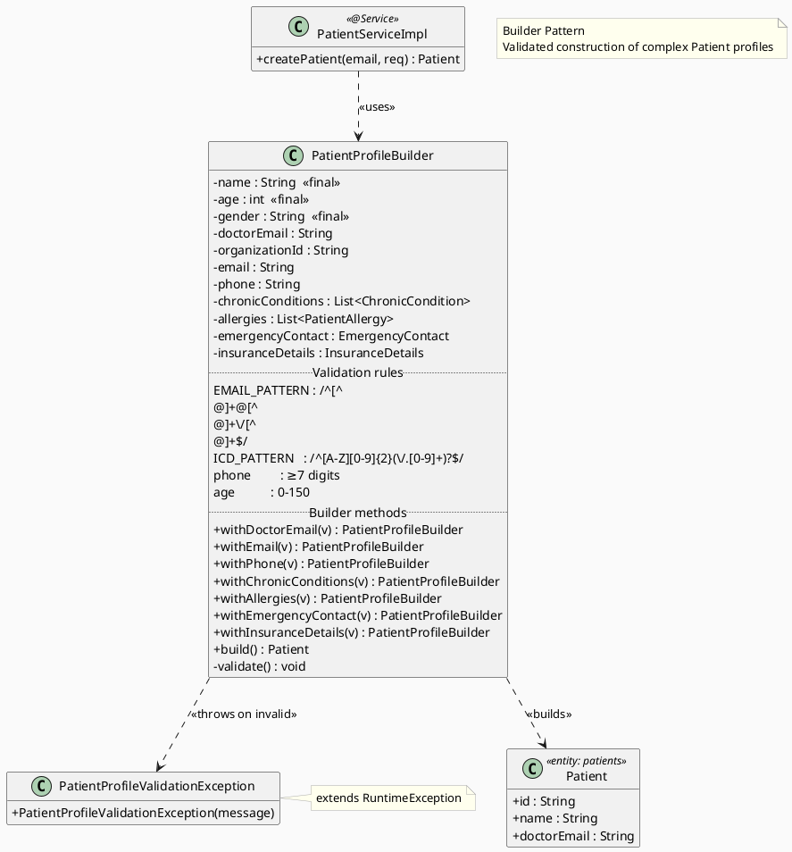

---

### `docs/Requirements_&_Subsystems/Subsystems/5.Lifecycle & Notifications Subsystem.puml`

```plantuml
@startuml Lifecycle_Notifications_Subsystem
skinparam backgroundColor #FAFAFA
skinparam defaultFontName Arial
skinparam classAttributeIconSize 0
skinparam packageStyle rectangle
skinparam noteBackgroundColor #FFFFEE
skinparam noteBorderColor #AAAAAA
hide empty members

note “State Pattern (FR-11)\nIllegal transitions throw — APPROVED is terminal” as NS

interface ConsultationState {
  + statusName() : String
  + transitionTo(targetStatus) : ConsultationState
}

class ScheduledState {
  statusName() = “SCHEDULED”
  note: allows IN_PROGRESS
}
class InProgressState {
  statusName() = “IN_PROGRESS”
  note: allows RECORDED
}
class RecordedState {
  statusName() = “RECORDED”
  note: allows TRANSCRIBED
}
class TranscribedState {
  statusName() = “TRANSCRIBED”
  note: allows UNDER_REVIEW
}
class UnderReviewState {
  statusName() = “UNDER_REVIEW”
  note: allows APPROVED or REJECTED
}
class ApprovedState <<terminal>> {
  statusName() = “APPROVED”
}
class RejectedState {
  statusName() = “REJECTED”
  note: allows UNDER_REVIEW
}

class IllegalStateTransitionException {
  IllegalStateTransitionException(from, to)
}

class ConsultationStateFactory {
  + {static} fromStatus(status) : ConsultationState
}

ScheduledState   ..|> ConsultationState
InProgressState  ..|> ConsultationState
RecordedState    ..|> ConsultationState
TranscribedState ..|> ConsultationState
UnderReviewState ..|> ConsultationState
ApprovedState    ..|> ConsultationState
RejectedState    ..|> ConsultationState
ConsultationState ..> IllegalStateTransitionException : <<throws on invalid>>
ConsultationStateFactory ..> ConsultationState : <<creates>>

note “Observer Pattern (FR-12)\nPublisher notifies all subscribers on every transition” as NO

class ConsultationEvent {
  - sessionId : String
  - doctorEmail : String
  - fromStatus : String
  - toStatus : String
}

interface ConsultationObserver {
  + onEvent(event : ConsultationEvent) : void
}

class ConsultationEventPublisher {
  - observers : List<ConsultationObserver>
  + subscribe(observer) : void
  + unsubscribe(observer) : void
  + publish(event) : void
}

class AuditLoggerObserver {
  - auditService : AuditService
  + onEvent(event) : void
}
note right : toStatus → audit action\n(session_started, note_approved…)

class DoctorNotifierObserver {
  + onEvent(event) : void
}
note right : Logs INFO for\nUNDER_REVIEW, APPROVED, REJECTED

class SessionStatusObserver {
  + onEvent(event) : void
}
note right : Logs all lifecycle transitions

AuditLoggerObserver    ..|> ConsultationObserver
DoctorNotifierObserver ..|> ConsultationObserver
SessionStatusObserver  ..|> ConsultationObserver
ConsultationEventPublisher “1” o-- “0..*” ConsultationObserver
ConsultationEventPublisher ..> ConsultationEvent : publishes
interface AuditService {
  + log(userEmail, action, entityType, entityId) : void
}

AuditLoggerObserver --> AuditService

note “Frontend mirror (TypeScript)\nFR-11 enforced client-side too” as NTS
class SessionStateMachine <<TS module>> {
  + {static} VALID_TRANSITIONS : Record<SessionStatus, SessionStatus[]>
  + {static} canTransition(from, to) : boolean
  + {static} assertTransition(from, to) : void
}

class SessionServiceImpl <<@Service>> {
  + transitionSession(email, id, targetStatus) : ClinicalSession
}
SessionServiceImpl --> ConsultationStateFactory
SessionServiceImpl --> ConsultationEventPublisher
@enduml
```

---

### `docs/Requirements_&_Subsystems/Subsystems/6.Audit & Admin Subsystem.puml`

```plantuml
@startuml Audit_Admin_Subsystem
skinparam backgroundColor #FAFAFA
skinparam defaultFontName Arial
skinparam classAttributeIconSize 0
skinparam packageStyle rectangle
skinparam noteBackgroundColor #FFFFEE
skinparam noteBorderColor #AAAAAA
hide empty members

class AuditLog <<entity: audit_logs>> {
  - id : UUID  <<PK, auto>>
  - userEmail : String
  - action : String
  - entityType : String
  - entityId : String
  - metadata : String  <<jsonb>>
  - createdAt : Instant  <<append-only>>
}
note right : Immutable — no update/delete\nactions: login_success, logout,\npatient_created/updated/deleted,\nsession_created/deleted,\nnote_approved/rejected…

interface AuditLogRepository <<JpaRepository<AuditLog,UUID>>> {
  + findRecentLogs(limit, offset) : List<AuditLog>
}

interface AuditService {
  + log(userEmail, action, entityType, entityId) : void
  + log(userEmail, action, entityType, entityId, metadataJson) : void
  + getRecentLogs(limit, offset) : List<AuditLog>
}

class AuditServiceImpl <<@Service>> {
  - auditLogRepository : AuditLogRepository
}
note right : Failures silently swallowed —\naudit must never block callers

interface UserService {
  + getAllUsers() : List<User>
  + getUser(id) : User
  + createUser(RegisterRequest) : User
  + activateUser(id) : User
  + deactivateUser(id) : User
  + getStats() : Map<String,Long>
}

class UserServiceImpl <<@Service>> {
  - userRepository : UserRepository
  - passwordEncoder : PasswordEncoder
}

class AdminFacade <<@Component>> {
  - userService : UserService
  - auditService : AuditService
  + getAllUsers() : List<User>
  + getUser(id) : User
  + createUser(request, actorEmail) : User
  + activateUser(targetId, actorEmail) : void
  + deactivateUser(targetId, actorEmail) : void
  + getStats() : Map<String,Long>
  + getAuditLogs(limit, offset) : List<AuditLog>
}
note right : Facade Pattern\nSingle entry-point for all admin ops\nHides UserService + AuditService coordination

class AdminController <<@RestController: /api/admin>> {
  + getAllUsers() : ResponseEntity
  + createUser() : ResponseEntity
  + activateUser() : ResponseEntity
  + deactivateUser() : ResponseEntity
  + getStats() : ResponseEntity
  + getAuditLogs() : ResponseEntity
}
note right : @PreAuthorize(“hasRole(‘ADMIN’)”)

class AuditServer <<TS module>> {
  + {static} logAuditServer(userEmail, action,\n  entityType, entityId, metadata?) : Promise<void>
}
note right : Server-side — called from\nNextAuth signIn/signOut events

class AuditClient <<TS module>> {
  + {static} logAudit(action, entityType,\n  entityId, metadata?) : Promise<void>
}
note right : Client-side fire-and-forget\nPOST /api/audit

class User <<entity: profiles>> {
  + email : String  <<PK>>
  + role : String
  + isActive : boolean
}

interface UserRepository {
  + findByEmail(email) : Optional<User>
}

AuditServiceImpl ..|> AuditService
UserServiceImpl  ..|> UserService
AuditServiceImpl --> AuditLogRepository
UserServiceImpl  --> UserRepository
AdminFacade      --> UserService
AdminFacade      --> AuditService
AdminController  --> AdminFacade
@enduml
```

---

### `docs/Requirements_&_Subsystems/Subsystems/7.Review & Sharing Subsystem.puml`

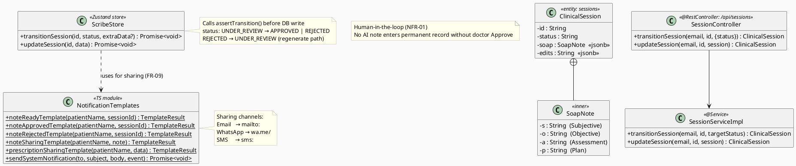

---

### `docs/Requirements_&_Subsystems/Subsystems/8.Prescription Generator Subsystem.puml`

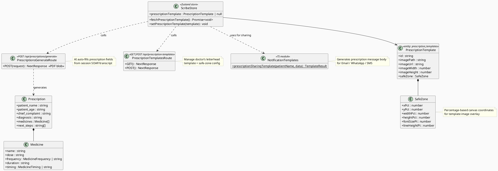

---

### `docs/Architecture_Framework/1_Logical view/1_Logical_View.md`

```markdown
# Logical View — ScribeHealth AI

The logical view describes the system's bounded contexts and key domain classes.

## Bounded Contexts

| Context | Key Classes | Role |
|---------|-------------|------|
| Auth & Access | User, JwtUtil, AuthService, SecurityConfig | Authentication, JWT issuance, role-based access |
| Patient & Session | Patient, ClinicalSession, PatientService, SessionService | Core domain entities and CRUD |
| AI Pipeline | TranscriptionProvider, SoapNoteGenerator, NoteGeneratorFactory | Transcription, entity extraction, SOAP generation |
| Lifecycle | ConsultationState, ConsultationEventPublisher, ConsultationObserver | State machine enforcement + event-driven notifications |
| Audit & Admin | AuditLog, AuditService, AdminFacade | Immutable audit trail, admin operations |
| Review & Sharing | NotificationTemplates, SessionStateMachine | Human-in-the-loop review, note sharing |
| Profile Builder | PatientProfileBuilder | Builder pattern for validated patient creation |
| Prescription | Prescription, PrescriptionTemplate | Doctor letterhead overlay + PDF generation |

## Diagrams

- `Package Diagram.puml` — Bounded context packages and cross-context dependencies
- `Activity Diagram.puml` — Domain event flow swimlane showing bounded context transitions

```

---

### `docs/Architecture_Framework/2_Process view/2_Process_View.md`

```markdown
# Process View — ScribeHealth AI

The process view describes runtime processes and their communication flows.

## Diagrams

| File | Description |
|------|-------------|
| `State_Machine.puml` | 7-state consultation lifecycle state machine (FR-11) |
| `Audio_Pipeline_Flow.puml` | End-to-end async audio pipeline: recording → transcription → entities → SOAP → review |

## Key processes

- **Transcription**: Async, non-blocking (NFR-02). `withRetry()` wraps `SarvamTranscriptionProvider` with 3 attempts, 1s→2s backoff (NFR-05).
- **State transitions**: `assertTransition()` enforced both client-side (TypeScript `SessionStateMachine`) and server-side (Java `ConsultationStateFactory`). Illegal transitions throw before any DB write.
- **Observer chain**: Every `transitionSession()` call fires `ConsultationEventPublisher.publish()` → `AuditLoggerObserver` + `DoctorNotifierObserver` + `SessionStatusObserver`.

```

---

### `docs/Architecture_Framework/3_Development view/3_Development_View.md`

```markdown
# Development View — ScribeHealth AI

The development view describes the static source code organisation and CI/CD pipeline.

## Diagrams

| File | Description |
|------|-------------|
| `Package_Structure_Diagram.puml` | Full package hierarchy: frontend (Next.js) + backend (Spring Boot) + docs |
| `CI_CD_Pipeline.puml` | CI/CD flow: local dev → GitHub PR → Actions (TS check + Maven) → Vercel + Cloud Run deploy |

## Key modules

| Module | Location | Pattern |
|--------|----------|---------|
| `transcription-factory.ts` | `frontend/lib/` | Factory Method |
| `soap-note-generator.ts` | `frontend/lib/` | Template Method |
| `session-state-machine.ts` | `frontend/lib/` | State (TS mirror) |
| `lifecycle/state/` | `backend/java/` | State (Java) |
| `lifecycle/observer/` | `backend/java/` | Observer |
| `facade/AdminFacade.java` | `backend/java/` | Facade |
| `builder/PatientProfileBuilder.java` | `backend/java/` | Builder |

```

---

### `docs/Architecture_Framework/4_Deployment view/4_Deployment_View.md`

```markdown
# Deployment View — ScribeHealth AI

The deployment view maps software artefacts to physical/virtual nodes.

## Node summary

| Node | Technology | Artefacts |
|------|-----------|-----------|
| Doctor's Browser | React 19 + Zustand + MediaRecorder | Next.js SPA |
| Vercel Edge Network | Next.js App Router + Serverless | API routes, SSR pages, CDN assets |
| Cloud Run / Railway | Java 17 JVM | Spring Boot JAR — REST, JWT, Observer, State |
| Supabase Cloud | PostgreSQL 15 + Object Storage + Realtime | All persistent data |
| Sarvam AI | REST API | Speech-to-Text (saarika:v2.5) |
| Anthropic | REST API | Claude Haiku + Sonnet |

## Security notes

- TLS enforced at all connection boundaries (NFR-01)
- Row-Level Security on Supabase: doctors see only their own patients/sessions
- JWT validated on every Spring Boot request via `JwtAuthFilter`

```

---

### `docs/Architecture_Framework/5_Use Case Diagrams/5_Use_Case_View.md`

```markdown
# Use Case View — ScribeHealth AI

## Actors

| Actor | Role |
|-------|------|
| Doctor | Primary user — records, reviews, approves, shares |
| Administrator | Manages users, views audit logs, system stats |
| System (AI Pipeline) | Automated — transcribes, extracts entities, generates SOAP, logs, notifies, retries |
| Patient | Passive recipient — receives shared notes / prescriptions |

## Diagrams

| File | Description |
|------|-------------|
| `All_Actors.puml` | Full use case diagram: UC-01 to UC-21, all actors, triggers, includes, extends |
| `Scenario_1.puml` | Happy path: Doctor records → AI pipeline → Doctor approves → share |
| `Scenario_2.puml` | Retry & reliability: `withRetry()` with 3 attempts, graceful degradation on full failure |

```

---

### `docs/Requirements_&_Subsystems/Subsystems/Subsystems.md`

```markdown
# Subsystems — ScribeHealth AI

## Subsystem Summary

| # | Subsystem | Key Patterns | FRs | NFRs |
|---|-----------|--------------|-----|------|
| SS0 | Auth & Access | — | FR-01, FR-02 | NFR-01 |
| SS1 | Patient & Session | — | FR-03, FR-04, FR-11 | NFR-02 |
| SS2 | AI Pipeline | Factory Method, Template Method | FR-04, FR-05, FR-06, FR-07 | NFR-03, NFR-05 |
| SS3 | Profile Builder | Builder | FR-03 | — |
| SS4 | Lifecycle & Notifications | State, Observer | FR-11, FR-12 | NFR-04 |
| SS5 | Audit & Admin | Facade | FR-02, FR-10 | NFR-04 |
| SS6 | Review & Sharing | — | FR-08, FR-09 | NFR-01 |
| SS7 | Prescription Generator | — | FR-06, FR-09 | — |

```

---

### `docs/Requirements_&_Subsystems/Context and Event flow Diagrams/Context and Event flow Diagrams.md`

```markdown
# Context and Event Flow Diagrams — ScribeHealth AI

## Diagrams

| File | Description |
|------|-------------|
| `System_Context_Diagram.puml` | High-level system boundary: actors, external services |
| `Strategic Domain Event Flow.puml` | Full end-to-end event flow: Auth → Recording → AI pipeline → Review → Sharing → Audit |

```

---

## How to commit

```bash
# For each commit group, create the files with the content above, then:
git add <files>
git commit -m "<message from table above>"

# After all 10 commits:
git push origin main
```
